# Step 2: Connect to APIs

## How to connect to Salesforce

Before building any n8n workflow that talks to Salesforce, we needed a way for n8n to authenticate against Salesforce's REST API. We set up a Salesforce **Connected App** and configured its OAuth credentials in n8n.

See the [official n8n Salesforce OAuth2 documentation](https://docs.n8n.io/integrations/builtin/credentials/salesforce#using-oauth2) for more details.

### 1. Create a Connected App in Salesforce

1. Log in to the target Salesforce org (sandbox or production) as an admin. And go to Setup.

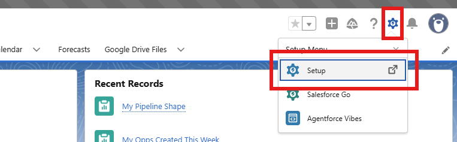

2. Search for **External Client App Manager** and click the matching result. If it does not appear, you may not have the required permissions; ask a Salesforce admin to grant access.Click **New Connected App** → **Create a Connected App**.

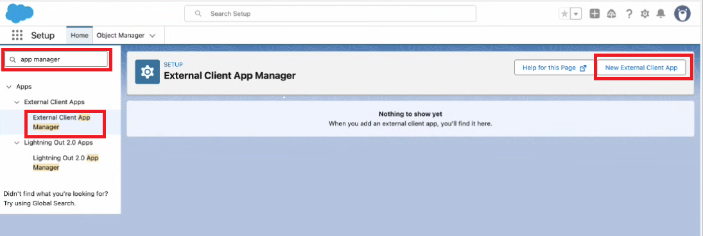

3. Fill in the basic info:
   - **Connected App Name**: e.g. `N8N Connected App`.
   - **API Name**: auto-filled from the name above.
   - **Contact Email**: your own or a team email.

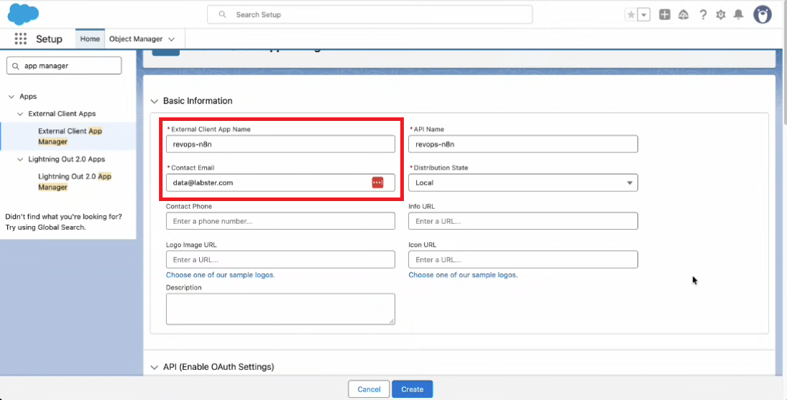

4. Enable OAuth settings:
   - Check **Enable OAuth Settings**.
   - **Callback URL**: `https://n8n.labster.it/rest/oauth2-credential/callback`.
   - Under **OAuth Scopes**, select:
     - **Full access (full)**.
     - **Perform requests at any time (refresh_token, offline_access)**.

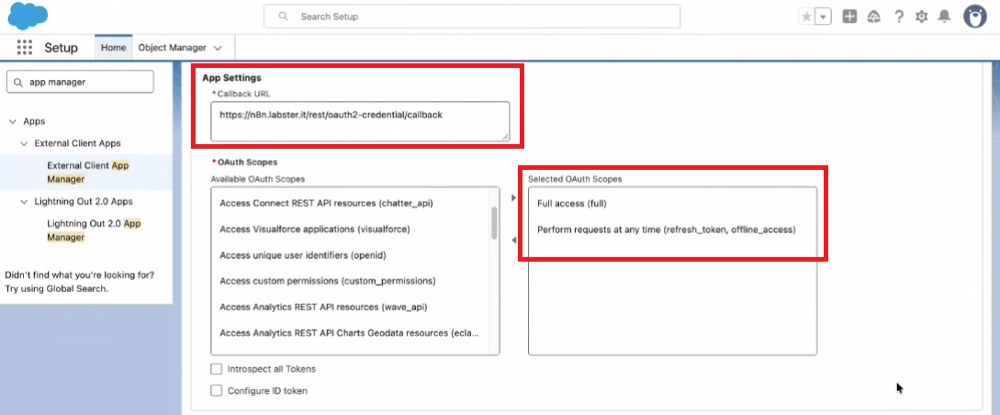

5. Under **Flow Enablement**, select **Enable Authorization Code and Credentials Flow**.

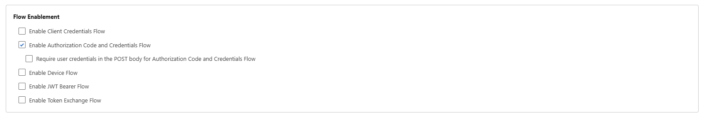

6. Under **OAuth Policies**, make sure these settings are checked:
   - **Require Secret for Web Server Flow**.
   - **Require Secret for Refresh Token Flow**.
   - **Require Proof Key for Code Exchange (PKCE) Extension for Supported Authorization Flows**.

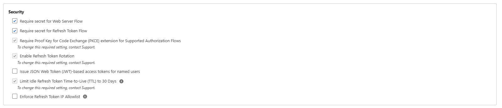

7. Select **Create**, then **Continue**. Salesforce can take a few minutes to apply the changes.

### 2. Get the Client ID and Client Secret

1. Click on the Connected App you just created to open its detail page and open **Settings**.
2. Go to the section **OAuth Settings** and click on **Consumer Key and Secret** (you must have the appropriate permissions to view this information).
3. Copy the **Consumer Key** (this is the **Client ID**) and the **Consumer Secret** (this is the **Client Secret**). Keep them safe — treat them like passwords.

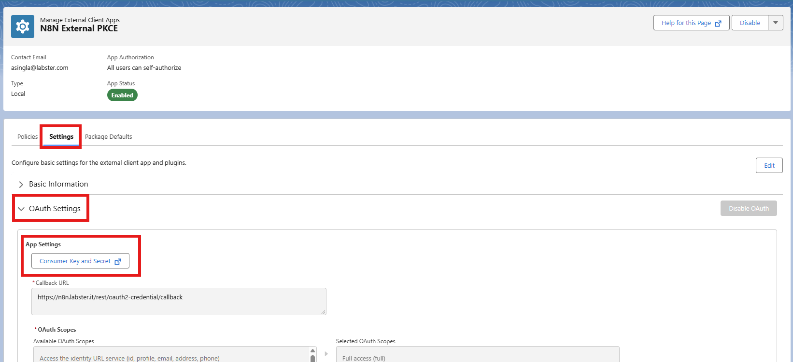

### 3. Configure the credential in n8n

1. In n8n, go to **Credentials** → **New Credential**.
2. Search for and select **Salesforce OAuth2 API**

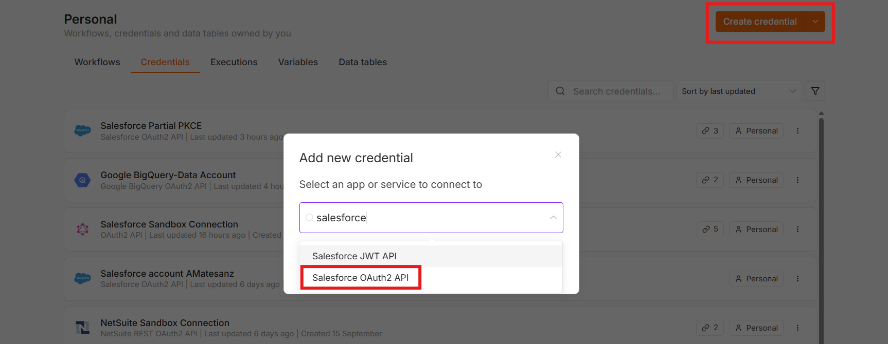

2. Fill in the fields:
   - **Add a Name** to your new connection.
   - **Client ID**: add the Consumer Key from step 2.
   - **Client Secret**: add the Consumer Secret from step 2.
3. Click on **Connect** to validate the connection.
4. Save the credential.

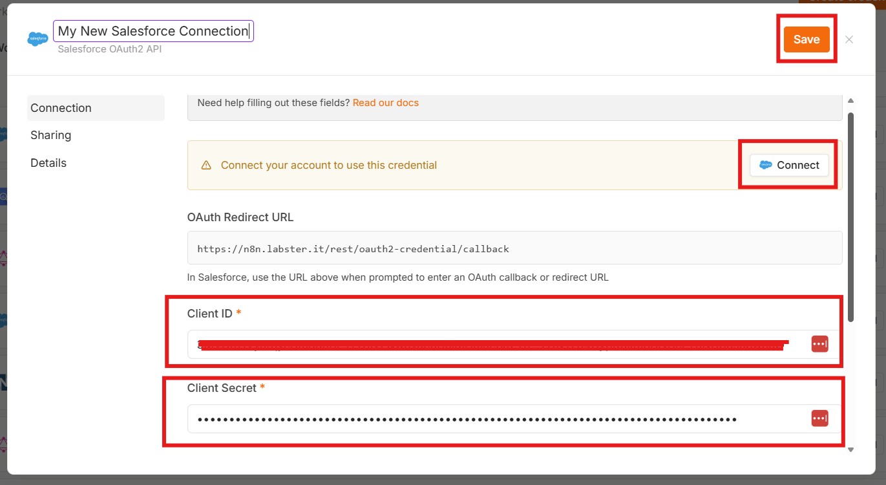

## How to connect to Netsuite

### 1. Enable OAuth 2.0 in NetSuite

[Official Docs](https://docs.oracle.com/en/cloud/saas/netsuite/ns-online-help/section_157771482304.html#To-enable-OAuth-2.0-feature%3A)

1. Log in to your NetSuite account with an administrator role.
2. Go to **Setup** → **Company** → **Enable Features**.
3. Click the **SuiteCloud** subtab.
4. In the **SuiteScript** section:
   - Check **Client SuiteScript** and click **I Agree** on the SuiteCloud Terms of Service page.
   - Check **Server SuiteScript** and click **I Agree** on the SuiteCloud Terms of Service page.
5. In the **SuiteTalk (Web Services)** section, enable:
   - **SOAP Web Services** — the standard SOAP-based interface for integrating external systems with NetSuite and migrating data.
   - **REST Web Services** — the standard REST-based interface for integrating external systems with NetSuite and migrating data.
6. In the **Manage Authentication** section, check **OAuth 2.0** and **Token Based Authentication** and click **I Agree** on the SuiteCloud Terms of Service page.
7. Save the changes.

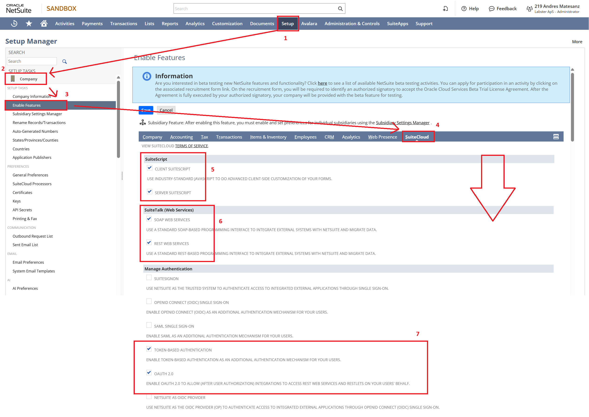

### 2. Get the Client ID and Client Secret

1. Navigate to **Setup** → **Integration** → **Manage Integrations**.
2. Click **New** to create a new integration.
3. Fill in the required fields:
   - **Name**: provide a name for your integration.
   - **Authorization Code Grant**: ensure this option is enabled for the integration.
   - **Redirect URI**: `https://n8n.labster.it/rest/oauth2-credential/callback`
   - **Restlets**: ensure this option is enabled for the integration.
   - **Rest Web Services**: ensure this option is enabled for the integration.
   - **OAuth 2.0 Content Policy**: Always ask.
4. Save the integration and copy the **Client ID** and **Client Secret**.

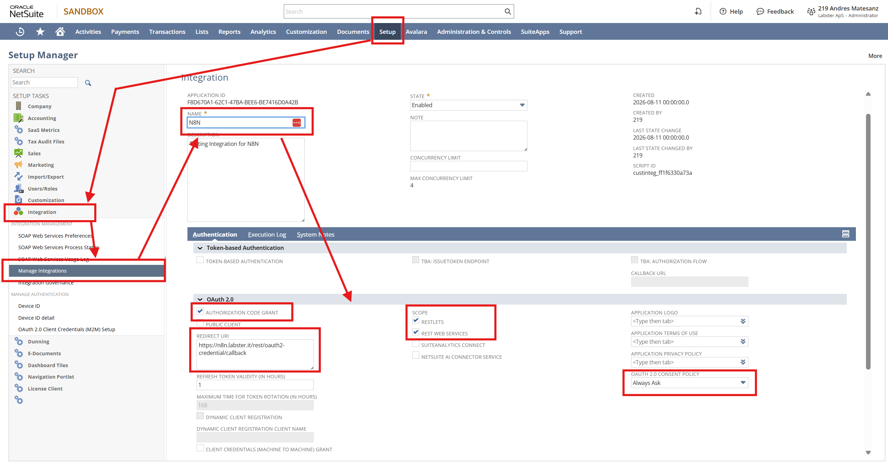

### 3. Configure the Credentials in N8N

1. Click on **Create Credentials** → **Netsuite REST OAuth2 API**

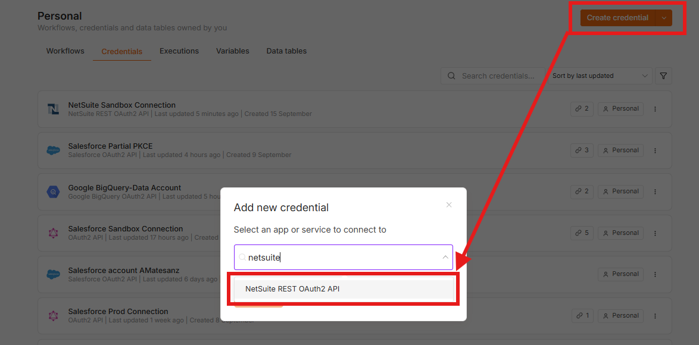

2. Fill in the fields:
   - **Add a Name** to your new connection.
   - **Client ID**: add the Client ID from step 2.
   - **Client Secret**: add the Client Secret from step 2.
   - **Account Subdomain**: copy from your prod/sandbox netsuite url: `https://<ACCOUNT_SUBDOMAIN>.app.netsuite.com` (ie: sandbox is `5056582-sb1`)
3. Click on **Connect** to verify the credentials.

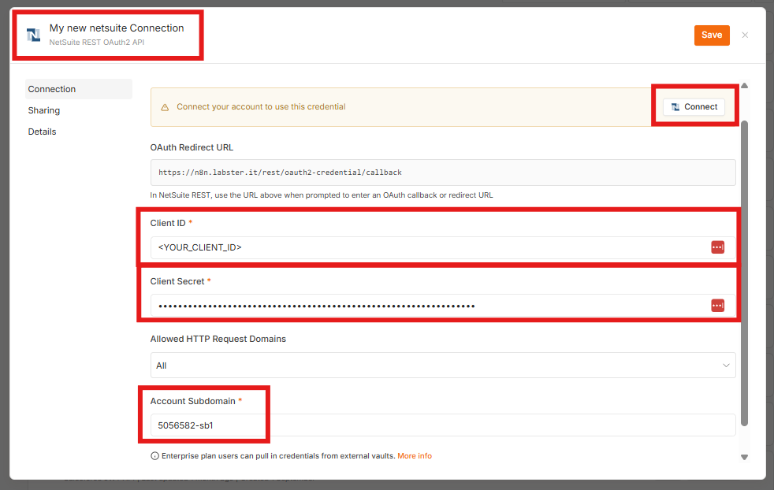
