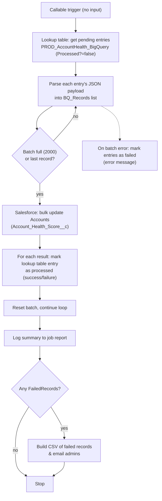

## Recipe Overview

This is a **callable child recipe** (invoked by "Sync account health score from BigQuery Parent"). It reads the pending entries from the `PROD_AccountHealth_BigQuery` lookup table (populated by the parent recipe) and syncs the health scores onto Salesforce `Account` records in batches, tracking success/failure per record and emailing admins a CSV of any failures at the end.

Flow: it builds an in-memory list of records from the lookup table entries where `Processed? = false`, then iterates them in batches of 2000. For each batch it calls Salesforce's composite update on `Account` (setting `Account_Health_Score__c`), then for each result marks the corresponding lookup table entry as processed (success or failure, with error details). Any records that fail Salesforce validation, or the whole batch pipeline erroring out, are recorded; at the end, if there are failed records, a CSV is generated and emailed to admins.

## Steps

### Step 0 — Trigger: Callable Execute

- **Name:** Execute (callable recipe trigger)
- **Logic (what it does?):** Entry point when the recipe is invoked by the parent recipe. Takes no parameters.
- **Inputs:** None
- **Outputs:** None
- **Step Number:** 0
- **Previous Step Number:** — (entry point)
- **Next Step Number:** 1

### Step 1 — Setup: Lists, Lookup Search, Counters

- **Name:** Create `BQ_Records` list, search lookup table entries, declare batch/counter variables, create `FailedRecords` list
- **Logic (what it does?):** Prepares the working state: an empty `BQ_Records` list to hold parsed records to send to Salesforce; searches `PROD_AccountHealth_BigQuery` for all entries where `Processed? = false` (the pending queue); sets `batch_size = 2000`; initializes `record_count`, `batch_count`, `success_count` (all `0`) and computes `total_batch` from the entry count and batch size; and creates an empty `FailedRecords` list for the final failure report.
- **Inputs:** `lookup_table_id: PROD_AccountHealth_BigQuery`, filter `col2 (Processed?) = false`
- **Outputs:** `BQ_Records` (empty list), `entries[]` (pending lookup table rows), `batch_size=2000`, `record_count=0`, `batch_count=0`, `success_count=0`, `total_batch`, `FailedRecords` (empty list)
- **Step Number:** 1
- **Previous Step Number:** 0
- **Next Step Number:** 2

### Step 2 — For Each Pending Entry: Parse and Batch

- **Name:** Loop over lookup table entries → parse JSON → accumulate batch → flush when full
- **Logic (what it does?):** For every pending lookup table entry (wrapped in `try`): parses the JSON string in `col1` (via a small JS snippet) into `account_id` / `score_health_overall`, appends it to `BQ_Records`, and increments `record_count`. When `record_count` reaches `batch_size` (2000) or this is the last entry, it flushes the batch (Step 3). If the batch fails entirely, the whole batch is marked as errored in the lookup table (Step 4 catch).
- **Inputs:** Lookup table entries from Step 1 (`col1` JSON payload)
- **Outputs:** `BQ_Records` list of `{account_id, score_health_overall}`; `record_count`
- **Step Number:** 2
- **Previous Step Number:** 1
- **Next Step Number:** 3 (when batch is full/last) or loops back to 2

### Step 3 — Flush Batch: Update Salesforce & Reconcile Results

- **Name:** Salesforce composite update Accounts (batch of 200) → mark each entry success/failure → reset batch
- **Logic (what it does?):** Sends the accumulated `BQ_Records` to Salesforce via a composite/bulk update on the `Account` object (sub-batches of 200, `allOrNone=false` so partial failures don't block the rest), setting `Account_Health_Score__c` = `score_health_overall` for each `Id` = `account_id`. Then, for each successful result, looks up the matching lookup table entry (by `AccountId_key`) and marks it processed (`col2=true`, message "Record successfully updated"), incrementing `success_count`. For each failed result, looks up the entry, marks it processed with the Salesforce error details, and adds it to `FailedRecords`. Finally increments `batch_count`, resets `record_count` to `0`, and clears `BQ_Records` for the next batch.
- **Inputs:** `BQ_Records` list; `PROD_AccountHealth_BigQuery` lookup table
- **Outputs:** Updated Salesforce `Account` records; updated lookup table entries; `success_count`, `batch_count`; `FailedRecords` entries for failures
- **Step Number:** 3
- **Previous Step Number:** 2
- **Next Step Number:** 2 (next batch) or 4 (after last batch)

### Step 4 — Error Handling (batch-level catch)

- **Name:** Catch block for the per-record `try` (Step 2)
- **Logic (what it does?):** If the batch processing throws an unexpected error, marks the current lookup table entry as failed with the error type/message.
- **Inputs:** Caught error type/message; current entry ID
- **Outputs:** Lookup table entry updated with failure message
- **Step Number:** 4
- **Previous Step Number:** 2–3 (on error)
- **Next Step Number:** 5

### Step 5 — Log Job Summary

- **Name:** Log message to Job report
- **Logic (what it does?):** Writes a summary line to the Workato job report: total records, total batches, batches processed.
- **Inputs:** `entries` count, `total_batch`, `batch_count`
- **Outputs:** Job report log entry
- **Step Number:** 5
- **Previous Step Number:** 2/3 (after loop completes)
- **Next Step Number:** 6

### Step 6 — Declare Current Date

- **Name:** Create variable `CurrentDate`
- **Logic (what it does?):** Captures today's date, used later in the failure notification email.
- **Inputs:** None
- **Outputs:** `CurrentDate`
- **Step Number:** 6
- **Previous Step Number:** 5
- **Next Step Number:** 7

### Step 7 — If Any Failed Records: Build CSV and Notify

- **Name:** Check `FailedRecords` size > 0 → create CSV → email admins
- **Logic (what it does?):** If `FailedRecords` is non-empty, builds a CSV (`account_id`, `error` columns) from the list. If account property `EmailDeliverability` is true, emails admins with a summary (total records, batches processed, success/failure counts) and the CSV of failed records attached.
- **Inputs:** `FailedRecords` list; account properties `EmailDeliverability`, `AdminEmailIDs`; `CurrentDate`; `success_count`, `batch_count`
- **Outputs:** CSV file; email sent (conditionally)
- **Step Number:** 7
- **Previous Step Number:** 6
- **Next Step Number:** 8

### Step 8 — Stop

- **Name:** Stop
- **Logic (what it does?):** Ends the recipe run successfully (`stop_with_error = false`).
- **Inputs:** `stop_with_error: "false"`
- **Outputs:** None
- **Step Number:** 8
- **Previous Step Number:** 7
- **Next Step Number:** — (end of recipe)
