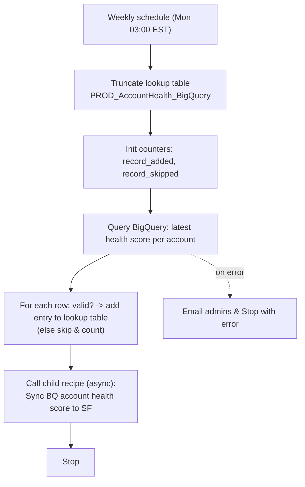

## Recipe Overview

This is a **scheduled parent recipe** that runs weekly (every Monday at 03:00 AM EST). Its job is to refresh a "cache" lookup table (`PROD_AccountHealth_BigQuery`) with the latest account health scores from BigQuery, and then kick off a child recipe that pushes those scores into Salesforce.

Flow: it truncates the lookup table, queries BigQuery for the latest health score per account (`bi.health_score_dashboard`, one row per `account_id` using the most recent `calendar_date`), and for each row inserts an entry into the lookup table (skipping/counting rows missing `account_id` or `score_health_overall`). It then asynchronously calls the child recipe **"Callable - Sync BQ account health score to SF account object Child"**, which is the one that actually writes to Salesforce. If the BigQuery step or anything in the `try` block fails, it emails the admins and stops with an error.

## Steps

### Step 0 — Trigger: Weekly Schedule

- **Name:** Scheduled event (clock trigger)
- **Logic (what it does?):** Fires once a week, every Monday at 03:00 AM (America/New_York).
- **Inputs:** Schedule config (`time_unit=weeks`, `trigger_every=1`, `trigger_at=03:00:00`, `days_of_week=Monday`, `timezone=America/New_York`)
- **Outputs:** None (time-based trigger)
- **Step Number:** 0
- **Previous Step Number:** — (entry point)
- **Next Step Number:** 1

### Step 1 — Truncate Lookup Table

- **Name:** Truncate all entries from `PROD_AccountHealth_BigQuery` lookup table
- **Logic (what it does?):** Deletes all existing rows from the lookup table so it can be repopulated with fresh data from BigQuery ("lookup table X to clear it before reload").
- **Inputs:** `lookup_table_id: PROD_AccountHealth_BigQuery`
- **Outputs:** None
- **Step Number:** 1
- **Previous Step Number:** 0
- **Next Step Number:** 2

### Step 2 — Declare Counters

- **Name:** Create variables `record_added`, `record_skipped`
- **Logic (what it does?):** Initializes two counters at `0`, used to track how many BigQuery rows were successfully added to the lookup table vs. skipped due to missing data.
- **Inputs:** None (static initial values)
- **Outputs:** `record_added` (integer), `record_skipped` (integer)
- **Step Number:** 2
- **Previous Step Number:** 1
- **Next Step Number:** 3

### Step 3 — Query BigQuery for Latest Health Scores

- **Name:** Search rows using custom SQL (Google BigQuery)
- **Logic (what it does?):** Runs a SQL query against `bi.health_score_dashboard` that, for each `account_id`, picks the most recent row by `calendar_date` (via `row_number() over (partition by account_id order by calendar_date desc)`), i.e. "lookup the latest health score per account". Wrapped in a `try` block so failures are caught later.
- **Inputs:** BigQuery project `labster-dwh`; SQL query (see above)
- **Outputs:** `rows[]` with `account_id`, `score_health_overall` per account
- **Step Number:** 3
- **Previous Step Number:** 2
- **Next Step Number:** 4

### Step 4 — For Each Row: Add to Lookup Table or Skip

- **Name:** For each BigQuery row → if valid → add entry to lookup table
- **Logic (what it does?):** Iterates over the BigQuery result rows. If both `account_id` and `score_health_overall` are present, inserts a new entry into `PROD_AccountHealth_BigQuery` (JSON payload in `col1`, `Processed?=false` in `col2`, status text in `col3`, `account_id` as key in `col5`) and increments `record_added`. If either field is missing, increments `record_skipped` instead (no entry is written).
- **Inputs:** Rows from Step 3
- **Outputs:** Lookup table entries; updated `record_added` / `record_skipped` counters
- **Step Number:** 4
- **Previous Step Number:** 3
- **Next Step Number:** 5

### Step 5 — Call Child Recipe (async)

- **Name:** Call `Callable - Sync BQ account health score to SF account object Child` (async)
- **Logic (what it does?):** Triggers, asynchronously, the callable child recipe responsible for reading the freshly populated lookup table and writing the health scores onto Salesforce Account records.
- **Inputs:** None (fire-and-forget call, no parameters)
- **Outputs:** None consumed here
- **Step Number:** 5
- **Previous Step Number:** 4
- **Next Step Number:** 6

### Step 6 — Error Handling (catch)

- **Name:** Catch block for the `try` (Steps 3–5)
- **Logic (what it does?):** If fetching from BigQuery (or anything inside the try) fails, and account property `EmailDeliverability` is true, sends an error email to `AdminEmailIDs` with job/recipe/error details, then stops the recipe with an error.
- **Inputs:** Account properties `EmailDeliverability`, `AdminEmailIDs`; caught error type/message
- **Outputs:** Email sent; recipe stopped with error
- **Step Number:** 6
- **Previous Step Number:** 3–5 (on failure)
- **Next Step Number:** 7 (if no error occurred)

### Step 7 — Stop

- **Name:** Stop
- **Logic (what it does?):** Ends the recipe run successfully (`stop_with_error = false`) after the try/catch completes normally.
- **Inputs:** `stop_with_error: "false"`
- **Outputs:** None
- **Step Number:** 7
- **Previous Step Number:** 3–5 (success path)
- **Next Step Number:** — (end of recipe)
