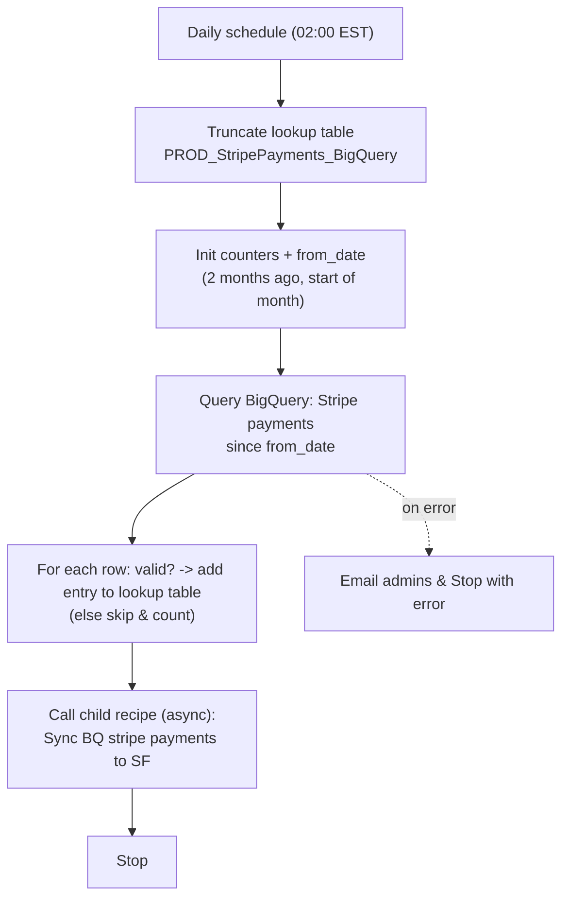

## Recipe Overview

This is a **scheduled parent recipe** that runs daily (every day at 02:00 AM EST). It refreshes a "cache" lookup table (`PROD_StripePayments_BigQuery`) with monthly Stripe payment totals per account from BigQuery (looking back from 2 months ago), then kicks off a child recipe that syncs those totals into Salesforce.

Flow: it truncates the lookup table, queries BigQuery (`stripe_data.stripe_workato`) for all rows from `from_date` (2 months ago, start of month) onward, and for each row inserts an entry into the lookup table (skipping/counting rows missing `account_id`, `first_day_of_month` or `total_amount`). It then asynchronously calls the child recipe **"Callable - Sync BQ stripe payments to SF Child"**. If the BigQuery step or anything in the `try` block fails, it emails the admins and stops with an error.

## Steps

### Step 0 — Trigger: Daily Schedule

- **Name:** Scheduled event (clock trigger)
- **Logic (what it does?):** Fires once a day at 02:00 AM (America/New_York).
- **Inputs:** Schedule config (`time_unit=days`, `trigger_every=1`, `trigger_at=02:00:00`, `timezone=America/New_York`)
- **Outputs:** None (time-based trigger)
- **Step Number:** 0
- **Previous Step Number:** — (entry point)
- **Next Step Number:** 1

### Step 1 — Truncate Lookup Table

- **Name:** Truncate all entries from `PROD_StripePayments_BigQuery` lookup table
- **Logic (what it does?):** Deletes all existing rows from the lookup table so it can be repopulated with fresh Stripe payment data ("lookup table X to clear it before reload").
- **Inputs:** `lookup_table_id: PROD_StripePayments_BigQuery`
- **Outputs:** None
- **Step Number:** 1
- **Previous Step Number:** 0
- **Next Step Number:** 2

### Step 2 — Declare Counters and Date Window

- **Name:** Create variables `record_added`, `record_skipped`, `from_date`
- **Logic (what it does?):** Initializes `record_added`/`record_skipped` counters at `0`, and computes `from_date` as the first day of the month 2 months ago (`2.months.ago.beginning_of_month`) formatted as `YYYY-MM`. This defines how far back the BigQuery query below looks.
- **Inputs:** None (computed from current date)
- **Outputs:** `record_added`, `record_skipped` (integers), `from_date` (string, e.g. `"2024-07"`)
- **Step Number:** 2
- **Previous Step Number:** 1
- **Next Step Number:** 3

### Step 3 — Query BigQuery for Stripe Payments

- **Name:** Search rows using custom SQL (Google BigQuery)
- **Logic (what it does?):** Runs a SQL query against `labster-dwh.stripe_data.stripe_workato` filtering `year_month >= from_date`, i.e. "lookup monthly Stripe payment totals per account from 2 months ago onward". Wrapped in a `try` block so failures are caught later.
- **Inputs:** BigQuery project `labster-dwh`; `from_date` from Step 2
- **Outputs:** `rows[]` with `account_id`, `first_day_of_month`, `currency`, `total_amount`, `transaction_count`, `year_month`
- **Step Number:** 3
- **Previous Step Number:** 2
- **Next Step Number:** 4

### Step 4 — For Each Row: Add to Lookup Table or Skip

- **Name:** For each BigQuery row → if valid → add entry to lookup table
- **Logic (what it does?):** Iterates over the BigQuery result rows. If `account_id`, `first_day_of_month` and `total_amount` are all present, inserts a new entry into `PROD_StripePayments_BigQuery` (JSON payload in `col1`, `Processed?=false` in `col2`, status text in `col3`, `account_id_yearMonth` composite key in `col5`) and increments `record_added`. Otherwise increments `record_skipped` (no entry is written).
- **Inputs:** Rows from Step 3
- **Outputs:** Lookup table entries; updated `record_added` / `record_skipped` counters
- **Step Number:** 4
- **Previous Step Number:** 3
- **Next Step Number:** 5

### Step 5 — Call Child Recipe (async)

- **Name:** Call `Callable - Sync BQ stripe payments to SF Child` (async)
- **Logic (what it does?):** Triggers, asynchronously, the callable child recipe responsible for reading the freshly populated lookup table and upserting Stripe payment records into Salesforce.
- **Inputs:** None (fire-and-forget call, no parameters)
- **Outputs:** None consumed here
- **Step Number:** 5
- **Previous Step Number:** 4
- **Next Step Number:** 6

### Step 6 — Error Handling (catch)

- **Name:** Catch block for the `try` (Steps 3–5)
- **Logic (what it does?):** If fetching from BigQuery (or anything inside the try) fails, and account property `EmailDeliverability` is true, sends an error email to `AdminEmailIDs` with job/recipe/error details, then stops the recipe with an error.
- **Inputs:** Account properties `EmailDeliverability`, `AdminEmailIDs`; caught error type/message
- **Outputs:** Email sent; recipe stopped with error
- **Step Number:** 6
- **Previous Step Number:** 3–5 (on failure)
- **Next Step Number:** 7 (if no error occurred)

### Step 7 — Stop

- **Name:** Stop
- **Logic (what it does?):** Ends the recipe run successfully (`stop_with_error = false`) after the try/catch completes normally.
- **Inputs:** `stop_with_error: "false"`
- **Outputs:** None
- **Step Number:** 7
- **Previous Step Number:** 3–5 (success path)
- **Next Step Number:** — (end of recipe)
