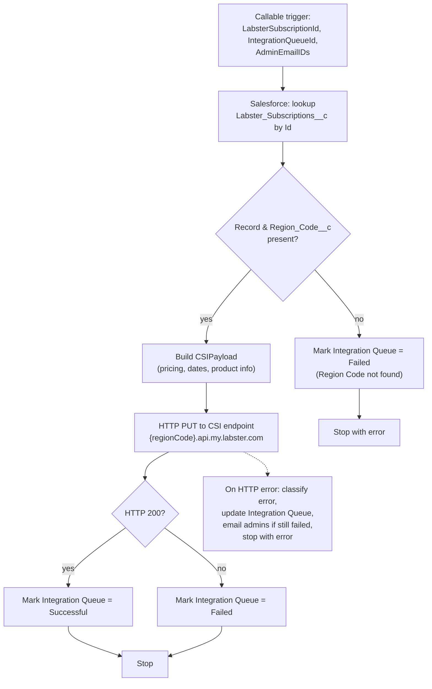

## Recipe Overview

This is a **callable child recipe**, invoked (presumably by another queue-processing recipe) with a `LabsterSubscriptionId`, an `IntegrationQueueId`, and `AdminEmailIDs`. Its job is to look up a Salesforce `Labster_Subscriptions__c` record, build a payload describing that subscription, and send it via HTTP PUT to Labster's CSI endpoint (a region-specific API host), then reflect the outcome back onto the originating `Integration_Queue__c` record.

Flow: it searches Salesforce for the subscription record by ID. If it exists and has a `Region_Code__c`, it builds the `CSIPayload` (product, pricing, dates, usage-calculation fields, etc., pulling related `Product2` fields via a join) and PUTs it to `https://{regionCode}.api.my.labster.com/salesforce/labster-subscriptions/{subscriptionId}`. If the HTTP call returns status 200, the Integration Queue record is marked `Successful`; otherwise it's marked `Failed` with the response details. Any exception during the HTTP call is caught, classified (system error if 5xx), the Integration Queue record updated accordingly, and — if it's still a failure — an email is sent to admins and the recipe stops with an error. If the subscription record or its Region Code isn't found, the Integration Queue record is marked `Failed` and the recipe stops with an error immediately.

## Steps

### Step 0 — Trigger: Callable Execute

- **Name:** Execute (callable recipe trigger)
- **Logic (what it does?):** Entry point when invoked by another recipe (e.g. the Integration Queue trigger routing logic).
- **Inputs:** `LabsterSubscriptionId` (string, required), `IntegrationQueueId` (string, required), `AdminEmailIDs` (string, required)
- **Outputs:** Same as inputs, passed through as recipe parameters
- **Step Number:** 0
- **Previous Step Number:** — (entry point)
- **Next Step Number:** 1

### Step 1 — Lookup Subscription in Salesforce

- **Name:** Search for Labster Subscriptions in Salesforce
- **Logic (what it does?):** Looks up the Salesforce custom object `Labster_Subscriptions__c` by `Id = LabsterSubscriptionId` ("lookup Labster Subscription record by its Salesforce ID"), limit 1.
- **Inputs:** `LabsterSubscriptionId`
- **Outputs:** Subscription record fields (Id, Region_Code__c, dates, pricing, product lookup, etc.) or empty if not found
- **Step Number:** 1
- **Previous Step Number:** 0
- **Next Step Number:** 2

### Step 2 — If Record and Region Code Present

- **Name:** IF `Id` present AND `Region_Code__c` present
- **Logic (what it does?):** Branches based on whether the subscription record was found and has a region code (needed to build the CSI endpoint URL).
- **Inputs:** `Id`, `Region_Code__c` from Step 1
- **Outputs:** None (control-flow only)
- **Step Number:** 2
- **Previous Step Number:** 1
- **Next Step Number:** 3 (if true) or 21 (if false)

### Step 3 — Build CSI Payload

- **Name:** Create variable `CSIPayload`
- **Logic (what it does?):** Assembles the JSON payload to send to CSI: `labster_subscription_sf_id`, `startDate`, `endDate`, `amount`, `currency`, `paymentMethod`, `paymentMethodDetails`, `gracePeriodEndDate`, `studentPrice`, `extensionDate`, `terminationDate`, `activeSubscriptionStartDate`/`EndDate`, `usageCalculationLogic`, `userAccessGatingException`/`Implemented`, plus product info (`productId`, `productName`, `productCode`, `productFamily`, `bundledLicenses`, `quantity`) fetched via a related lookup on `Product2` (joined through `Product__c`).
- **Inputs:** Subscription record fields from Step 1 (including related `Product2` fields)
- **Outputs:** `CSIPayload` (object)
- **Step Number:** 3
- **Previous Step Number:** 2
- **Next Step Number:** 4

### Step 4 — Try: Send to CSI

- **Name:** `try` block wrapping the HTTP call and its result handling
- **Logic (what it does?):** Wraps Steps 5–9 so any failure is caught by Step 10.
- **Inputs:** —
- **Outputs:** —
- **Step Number:** 4
- **Previous Step Number:** 3
- **Next Step Number:** 5

### Step 5 — Send LabsterSubscription Record to CSI

- **Name:** HTTP PUT request "Send LabsterSubscription record to CSI"
- **Logic (what it does?):** Sends `CSIPayload` as JSON via `PUT` to `https://{Region_Code__c}.api.my.labster.com/salesforce/labster-subscriptions/{subscriptionId}`.
- **Inputs:** `CSIPayload`, `Region_Code__c`, subscription `Id`
- **Outputs:** HTTP response (`statusCode`, `message`, body)
- **Step Number:** 5
- **Previous Step Number:** 4
- **Next Step Number:** 6

### Step 6 — If HTTP 200: Mark Success

- **Name:** IF response `statusCode = 200`
- **Logic (what it does?):** Branches on whether CSI accepted the request.
- **Inputs:** `statusCode` from Step 5
- **Outputs:** None (control-flow only)
- **Step Number:** 6
- **Previous Step Number:** 5
- **Next Step Number:** 7 (if true) or 8 (if false)

### Step 7 — Mark Integration Queue Successful

- **Name:** Update Integration Queue in Salesforce (success path)
- **Logic (what it does?):** Sets `Integration_Queue__c.Processed_Flag__c = "Successful"` and a success `Event_Message__c`.
- **Inputs:** `IntegrationQueueId`
- **Outputs:** Updated Salesforce record
- **Step Number:** 7
- **Previous Step Number:** 6
- **Next Step Number:** 24 (recipe end)

### Step 8 — Mark Integration Queue Failed (HTTP non-200)

- **Name:** Update Integration Queue in Salesforce (else branch)
- **Logic (what it does?):** Sets `Processed_Flag__c = "Failed"` with the CSI response status code and message in `Event_Message__c`.
- **Inputs:** `IntegrationQueueId`, `statusCode`, response `message`
- **Outputs:** Updated Salesforce record
- **Step Number:** 8
- **Previous Step Number:** 6
- **Next Step Number:** 24 (recipe end)

### Step 9 — Catch: HTTP Call Failed

- **Name:** `catch` block for Step 4 (the try around the HTTP call)
- **Logic (what it does?):** Handles any exception thrown by the HTTP request (e.g. network error, non-2xx treated as exception, timeout).
- **Inputs:** Caught error type/message
- **Outputs:** —
- **Step Number:** 9
- **Previous Step Number:** 4–8 (on error)
- **Next Step Number:** 10

### Step 10 — Init Error Variables

- **Name:** Create variables `EventMessage`, `isSystemError`, `ProcessedFlag`
- **Logic (what it does?):** Sets initial defaults: `EventMessage` describing the failure, `isSystemError = false`, `ProcessedFlag = "Failed"`.
- **Inputs:** Caught error type/message from Step 9
- **Outputs:** `EventMessage`, `isSystemError`, `ProcessedFlag`
- **Step Number:** 10
- **Previous Step Number:** 9
- **Next Step Number:** 11

### Step 11 — Try: Parse HTTP Error Details

- **Name:** `try` block to parse the raw error message
- **Logic (what it does?):** Wraps Step 12 so a parsing failure falls back to the defaults from Step 10 via Step 13's catch.
- **Inputs:** —
- **Outputs:** —
- **Step Number:** 11
- **Previous Step Number:** 10
- **Next Step Number:** 12

### Step 12 — Extract HTTP Error Code/Message and Reclassify

- **Name:** Create variables `HttpErrorCode`, `HttpErrorMessage`; update `EventMessage`/`isSystemError`/`ProcessedFlag`
- **Logic (what it does?):** Parses the caught error's message string to extract an HTTP status code (first 3 characters) and the JSON error body (from the first `{`), i.e. "lookup HTTP status code within the raw error text". Then refines `EventMessage` with those details and sets `isSystemError = true` if the status code starts with `5` (server-side error), else `false`. `ProcessedFlag` stays `"Failed"`.
- **Inputs:** Caught error message from Step 9
- **Outputs:** `HttpErrorCode`, `HttpErrorMessage`, updated `EventMessage`/`isSystemError`/`ProcessedFlag`
- **Step Number:** 12
- **Previous Step Number:** 11
- **Next Step Number:** 17

### Step 13 — Catch: Parsing Failed

- **Name:** `catch` block for Step 11
- **Logic (what it does?):** If parsing the error details itself fails, overrides `EventMessage`/`isSystemError`/`ProcessedFlag` with a generic "successfully sent" style message — effectively a fallback reset (mirrors the success message text, likely a copy/paste artifact in the original recipe worth flagging during migration).
- **Inputs:** —
- **Outputs:** `EventMessage`, `isSystemError=false`, `ProcessedFlag="Successful"`
- **Step Number:** 13
- **Previous Step Number:** 11–12 (on error)
- **Next Step Number:** 17

> **Note:** This appears to be a copy-paste bug in the original Workato recipe. On the fallback/failure path (when parsing the HTTP error details itself fails), it overwrites `EventMessage`/`isSystemError`/`ProcessedFlag` with the **success** message and status instead of preserving the failure state set in Step 10. When migrating to n8n, decide whether to fix this bug or intentionally replicate the current (buggy) behavior.

### Step 17 — Update Integration Queue with Error Details

- **Name:** Update Integration Queue in Salesforce (from catch path)
- **Logic (what it does?):** Writes `Event_Message__c`, `Raw_Message__c`, `System_Error__c`, `Processed_Flag__c` onto the Integration Queue record using the values computed in Steps 10/12/13.
- **Inputs:** `IntegrationQueueId`, `EventMessage`, `isSystemError`, `ProcessedFlag`
- **Outputs:** Updated Salesforce record
- **Step Number:** 17
- **Previous Step Number:** 12 or 13
- **Next Step Number:** 18

### Step 18 — If Failed: Notify Admins

- **Name:** IF `EmailDeliverability` account property is true AND `ProcessedFlag = "Failed"`
- **Logic (what it does?):** Decides whether to send a failure notification email.
- **Inputs:** Account property `EmailDeliverability`, `ProcessedFlag`
- **Outputs:** None (control-flow only)
- **Step Number:** 18
- **Previous Step Number:** 17
- **Next Step Number:** 19 (if true) or 24 (if false)

### Step 19 — Email Admins

- **Name:** Send mail "If failed to call CSI endpoint then send a mail to admin"
- **Logic (what it does?):** Emails `AdminEmailIDs` with the subscription ID, recipe/job IDs, and error type/message.
- **Inputs:** `AdminEmailIDs`, `LabsterSubscriptionId`, job context, caught error
- **Outputs:** Email sent
- **Step Number:** 19
- **Previous Step Number:** 18
- **Next Step Number:** 20

### Step 20 — Stop with Error

- **Name:** Stop ("Failed to Send LabsterSubscription data to CSI Endpoint")
- **Logic (what it does?):** Ends the recipe run with an error status and a fixed reason message.
- **Inputs:** —
- **Outputs:** —
- **Step Number:** 20
- **Previous Step Number:** 19
- **Next Step Number:** — (end of recipe, error)

### Step 21 — Else: Record or Region Code Not Found

- **Name:** `else` branch of Step 2
- **Logic (what it does?):** Executed when the subscription wasn't found or has no `Region_Code__c`.
- **Inputs:** —
- **Outputs:** —
- **Step Number:** 21
- **Previous Step Number:** 2
- **Next Step Number:** 22

### Step 22 — Mark Integration Queue Failed (Missing Region Code)

- **Name:** Update Integration Queue in Salesforce (region code missing)
- **Logic (what it does?):** Sets `Processed_Flag__c = "Failed"`, `Event_Message__c`/`Raw_Message__c` = "Region Code not found in the LabsterSubscription record. RecordId: {id}".
- **Inputs:** `IntegrationQueueId`, subscription `Id`
- **Outputs:** Updated Salesforce record
- **Step Number:** 22
- **Previous Step Number:** 21
- **Next Step Number:** 23

### Step 23 — Stop with Error (Region Code Not Found)

- **Name:** Stop ("Region Code not found in the LabsterSubscription record")
- **Logic (what it does?):** Ends the recipe run with an error status and a fixed reason message.
- **Inputs:** —
- **Outputs:** —
- **Step Number:** 23
- **Previous Step Number:** 22
- **Next Step Number:** — (end of recipe, error)

### Step 24 — Stop

- **Name:** Stop
- **Logic (what it does?):** Ends the recipe run successfully (`stop_with_error = false`) after the success path (Step 7 or 8) or the notify-admins path (Step 18, if not failed) completes.
- **Inputs:** `stop_with_error: "false"`
- **Outputs:** None
- **Step Number:** 24
- **Previous Step Number:** 7, 8, or 18
- **Next Step Number:** — (end of recipe, success)
