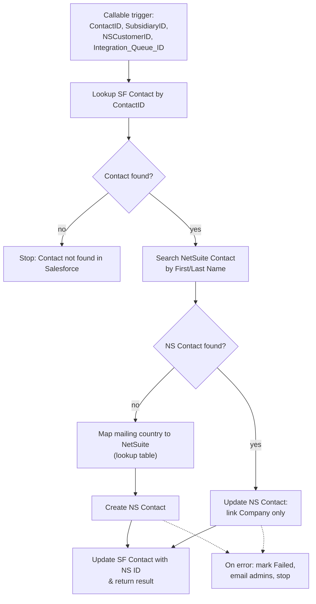

# NS & NF Automation - Callable - Create Contact in Netsuite

## Recipe Overview

This is a **callable child recipe** used to create or update a NetSuite **Contact** record from a Salesforce Contact, and link it to the given NetSuite Customer (Company) and Subsidiary.

Flow: it fetches the Salesforce Contact by `ContactID`. If found, it searches NetSuite for an existing Contact by First/Last Name. If none is found, it maps the Salesforce mailing country to NetSuite via the `PROD_NS_Countries` lookup table and **creates** a new NetSuite Contact (Name, Salutation, Title, Phones, Email, Address, Subsidiary, Company). If a match is found, it **updates** the existing NetSuite Contact but only to link it to the given Company (`NSCustomerID`) — it does not overwrite existing email/phone/address on the NetSuite side. In both cases, the Salesforce Contact is updated with the resulting NetSuite Contact ID and a result is returned to the caller. Any failure updates the `Integration_Queue__c` record as "Failed", optionally emails admins, and stops with an error. If the Salesforce Contact isn't found at all, the recipe stops immediately with an error.

## Steps

### Step 0 — Trigger: Callable Execute

- **Name:** Execute (callable recipe trigger)
- **Logic (what it does?):** Entry point invoked by a parent recipe (e.g. the Customer creation flow) to sync a Contact into NetSuite.
- **Inputs:** `ContactID`, `SubsidiaryID`, `NSCustomerID`, `AdminEmailIds`, `Integration_Queue_ID`
- **Outputs:** Same as inputs, passed through as recipe parameters
- **Step Number:** 0
- **Previous Step Number:** — (entry point)
- **Next Step Number:** 1

### Step 1 — Lookup Salesforce Contact

- **Name:** Search for Contacts in Salesforce
- **Logic (what it does?):** Searches Salesforce for the Contact matching `ContactID`.
- **Inputs:** `ContactID`
- **Outputs:** Contact fields (Name, MailingCountry, Email, Phone, etc.) or empty if not found
- **Step Number:** 1
- **Previous Step Number:** 0
- **Next Step Number:** 2

### Step 2 — If Contact Found

- **Name:** IF Contact present
- **Logic (what it does?):** Branches based on whether the Contact lookup returned a record.
- **Inputs:** Contact record from Step 1
- **Outputs:** None (control-flow only)
- **Step Number:** 2
- **Previous Step Number:** 1
- **Next Step Number:** 3 (if found) or 25 (if not found)

### Step 3 — Search NetSuite Contact

- **Name:** Search Contacts in NetSuite
- **Logic (what it does?):** Queries NetSuite for a Contact matching the Salesforce Contact's First Name and Last Name (loose deduplication).
- **Inputs:** First Name, Last Name (from Step 1)
- **Outputs:** NetSuite Contact `internalId` (if found)
- **Step Number:** 3
- **Previous Step Number:** 2
- **Next Step Number:** 4

### Step 4 — If NetSuite Contact Found: Update vs Create

- **Name:** IF a NetSuite Contact was found
- **Logic (what it does?):** Routes to the create path (Step 5+) if no match was found, or the update path (Step 15+) if one exists.
- **Inputs:** Search result from Step 3
- **Outputs:** None (control-flow only)
- **Step Number:** 4
- **Previous Step Number:** 3
- **Next Step Number:** 5 (create) or 15 (update)

### Step 5 — Map Mailing Country to NetSuite

- **Name:** Fetch NetSuite Country Internal Id (lookup table `PROD_NS_Countries`)
- **Logic (what it does?):** Looks up the Salesforce Contact's mailing country to get the NetSuite-compatible country value.
- **Inputs:** Contact `MailingCountry` (Step 1)
- **Outputs:** NetSuite country code/internal ID
- **Step Number:** 5
- **Previous Step Number:** 4
- **Next Step Number:** 6

### Step 6 — Try: Create NetSuite Contact

- **Name:** `try` wrapping the create path (Steps 7–9)
- **Logic (what it does?):** Wraps the create-contact logic so failures are caught by Step 10.
- **Inputs:** —
- **Outputs:** —
- **Step Number:** 6
- **Previous Step Number:** 5
- **Next Step Number:** 7

### Step 7 — Create NetSuite Contact

- **Name:** Create Contact in NetSuite
- **Logic (what it does?):** Creates a new NetSuite Contact mapping Name, Salutation, Title, Phones, Email, Address (with mapped country), `Subsidiary` (`SubsidiaryID`), and Company (`NSCustomerID`).
- **Inputs:** Contact fields (Step 1), mapped country (Step 5), `SubsidiaryID`, `NSCustomerID`
- **Outputs:** New NetSuite Contact `internalId`
- **Step Number:** 7
- **Previous Step Number:** 6
- **Next Step Number:** 8

### Step 8 — Update Salesforce Contact with NetSuite ID

- **Name:** Update NS Contact Internal Id in SF Contact
- **Logic (what it does?):** Writes the newly created NetSuite Contact's `internalId` onto the Salesforce Contact's `Netsuite_Contact_Id__c` field.
- **Inputs:** `ContactID`, new NetSuite `internalId`
- **Outputs:** Updated Salesforce Contact
- **Step Number:** 8
- **Previous Step Number:** 7
- **Next Step Number:** 9

### Step 9 — Return Result (Create)

- **Name:** Return Netsuite Contact InternalId
- **Logic (what it does?):** Returns `"Contact created successfully in Netsuite"` and `NSContact_InternalId` to the calling recipe.
- **Inputs:** New NetSuite `internalId`
- **Outputs:** `Message`, `NSContact_InternalId`
- **Step Number:** 9
- **Previous Step Number:** 8
- **Next Step Number:** 27 (recipe end)

### Step 10 — Catch: Create Failed

- **Name:** `catch` block for Step 6
- **Logic (what it does?):** Handles any failure while creating the NetSuite Contact (Steps 11–14).
- **Inputs:** Caught error type/message
- **Outputs:** —
- **Step Number:** 10
- **Previous Step Number:** 7–9 (on error)
- **Next Step Number:** 11

### Step 11 — If Email Deliverability: Notify Admins (Create Failure)

- **Name:** IF `EmailDeliverability` account property is true
- **Logic (what it does?):** Decides whether to send a failure notification email.
- **Inputs:** Account property `EmailDeliverability`
- **Outputs:** None (control-flow only)
- **Step Number:** 11
- **Previous Step Number:** 10
- **Next Step Number:** 12 (if true) or 13 (if false)

### Step 12 — Email Admins (Create Failure)

- **Name:** Send mail "If failed to create NS contact then send a mail to admin"
- **Logic (what it does?):** Emails `AdminEmailIds` with recipe/job IDs and error details.
- **Inputs:** `AdminEmailIds`, job context, caught error
- **Outputs:** Email sent
- **Step Number:** 12
- **Previous Step Number:** 11
- **Next Step Number:** 13

### Step 13 — Mark Integration Queue Failed (Create)

- **Name:** Update Integration Queue: "If failed to create NS contact then update Integration Queue record"
- **Logic (what it does?):** Sets `Processed_Flag__c = "Failed"` with the error trace.
- **Inputs:** `Integration_Queue_ID`, caught error
- **Outputs:** Updated Salesforce record
- **Step Number:** 13
- **Previous Step Number:** 11 or 12
- **Next Step Number:** 14

### Step 14 — Stop with Error (Create Failed)

- **Name:** Stop ("Failed to create Contact in Netsuite")
- **Logic (what it does?):** Ends the recipe run with an error.
- **Inputs:** —
- **Outputs:** —
- **Step Number:** 14
- **Previous Step Number:** 13
- **Next Step Number:** — (end of recipe, error)

### Step 15 — Else: Try Update NetSuite Contact

- **Name:** `else` branch of Step 4 → `try` wrapping the update path (Steps 17–19)
- **Logic (what it does?):** Taken when a matching NetSuite Contact was found; wraps the update logic so failures are caught by Step 20.
- **Inputs:** —
- **Outputs:** —
- **Step Number:** 15
- **Previous Step Number:** 4
- **Next Step Number:** 16

### Step 16 — Try Block

- **Name:** `try` (nested)
- **Logic (what it does?):** Wraps Steps 17–19.
- **Inputs:** —
- **Outputs:** —
- **Step Number:** 16
- **Previous Step Number:** 15
- **Next Step Number:** 17

### Step 17 — Update NetSuite Contact

- **Name:** Update Contact in NetSuite
- **Logic (what it does?):** Updates the existing NetSuite Contact (`internalId` from Step 3), linking it to the given Company (`NSCustomerID`) only — it does **not** overwrite the existing email, phone, or address fields on the NetSuite side.
- **Inputs:** NetSuite Contact `internalId` (Step 3), `NSCustomerID`
- **Outputs:** Updated NetSuite Contact record
- **Step Number:** 17
- **Previous Step Number:** 16
- **Next Step Number:** 18

### Step 18 — Update Salesforce Contact with NetSuite ID

- **Name:** Update NS Contact Internal Id in SF Contact
- **Logic (what it does?):** Writes the existing NetSuite Contact's `internalId` onto the Salesforce Contact's `Netsuite_Contact_Id__c` field.
- **Inputs:** `ContactID`, NetSuite `internalId` (Step 3)
- **Outputs:** Updated Salesforce Contact
- **Step Number:** 18
- **Previous Step Number:** 17
- **Next Step Number:** 19

### Step 19 — Return Result (Update)

- **Name:** Return Netsuite Contact InternalId
- **Logic (what it does?):** Returns `"Contact updated successfully in Netsuite"` and `NSContact_InternalId` to the calling recipe.
- **Inputs:** NetSuite `internalId`
- **Outputs:** `Message`, `NSContact_InternalId`
- **Step Number:** 19
- **Previous Step Number:** 18
- **Next Step Number:** 27 (recipe end)

### Step 20 — Catch: Update Failed

- **Name:** `catch` block for Step 15/16
- **Logic (what it does?):** Handles any failure while updating the NetSuite Contact (Steps 21–24).
- **Inputs:** Caught error type/message
- **Outputs:** —
- **Step Number:** 20
- **Previous Step Number:** 17–19 (on error)
- **Next Step Number:** 21

### Step 21 — If Email Deliverability: Notify Admins (Update Failure)

- **Name:** IF `EmailDeliverability` account property is true
- **Logic (what it does?):** Decides whether to send a failure notification email for the update path.
- **Inputs:** Account property `EmailDeliverability`
- **Outputs:** None (control-flow only)
- **Step Number:** 21
- **Previous Step Number:** 20
- **Next Step Number:** 22 (if true) or 23 (if false)

### Step 22 — Email Admins (Update Failure)

- **Name:** Send mail "If failed to create NS contact then send a mail to admin" *(same wording as the create-failure email in the source recipe — likely a copy/paste artifact)*
- **Logic (what it does?):** Emails `AdminEmailIds` with recipe/job IDs and error details.
- **Inputs:** `AdminEmailIds`, job context, caught error
- **Outputs:** Email sent
- **Step Number:** 22
- **Previous Step Number:** 21
- **Next Step Number:** 23

### Step 23 — Mark Integration Queue Failed (Update)

- **Name:** Update Integration Queue: "If failed to create NS contact then update Integration Queue record" *(same wording note as above)*
- **Logic (what it does?):** Sets `Processed_Flag__c = "Failed"` with the error trace.
- **Inputs:** `Integration_Queue_ID`, caught error
- **Outputs:** Updated Salesforce record
- **Step Number:** 23
- **Previous Step Number:** 21 or 22
- **Next Step Number:** 24

### Step 24 — Stop with Error (Update Failed)

- **Name:** Stop ("Failed to update Contact in Netsuite")
- **Logic (what it does?):** Ends the recipe run with an error.
- **Inputs:** —
- **Outputs:** —
- **Step Number:** 24
- **Previous Step Number:** 23
- **Next Step Number:** — (end of recipe, error)

### Step 25 — Else: Contact Not Found

- **Name:** `else` branch of Step 2
- **Logic (what it does?):** Taken when the Salesforce Contact lookup (Step 1) returned no record.
- **Inputs:** —
- **Outputs:** —
- **Step Number:** 25
- **Previous Step Number:** 2
- **Next Step Number:** 26

### Step 26 — Stop with Error (Contact Not Found)

- **Name:** Stop ("Contact not found in Salesforce")
- **Logic (what it does?):** Ends the recipe run with an error.
- **Inputs:** —
- **Outputs:** —
- **Step Number:** 26
- **Previous Step Number:** 25
- **Next Step Number:** — (end of recipe, error)

### Step 27 — Stop

- **Name:** Stop
- **Logic (what it does?):** Final stop reached after either successful return path (Step 9 or Step 19).
- **Inputs:** —
- **Outputs:** —
- **Step Number:** 27
- **Previous Step Number:** 9 or 19
- **Next Step Number:** — (end of recipe, success)

## Key Business Logic Notes

- **Deduplication Strategy:** NetSuite duplication checks are handled loosely, searching strictly against `firstName` and `lastName` only (no email/company match).
- **Selective Update Mapping:** If the Contact already exists in NetSuite, the recipe *only* updates the associated `Company` field on the NetSuite side — it does not overwrite existing email, phone, or address fields.
- **Data Transformation:** Uses the shared `PROD_NS_Countries` Workato Lookup Table to translate Salesforce country text into NetSuite's expected country value, same mechanism as the Create Customer recipe.
- **Copy/Paste Wording:** The update-path failure email/Integration Queue messages (Steps 22–23) reuse the "create" wording from the create path; consider clarifying wording when migrating to n8n.
