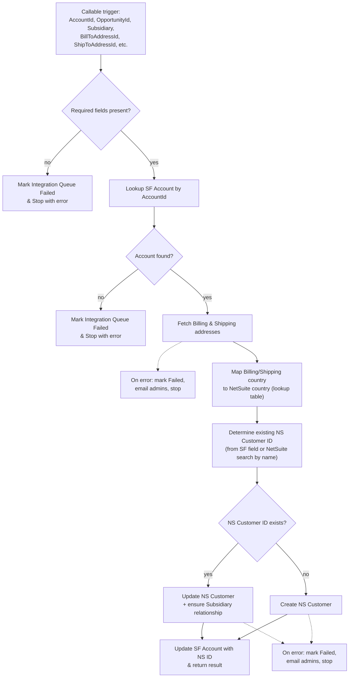

# NS & NF Automation - Callable - Create Customer in Netsuite

## Recipe Overview

This is a **callable child recipe** used to create or update a NetSuite **Customer** record from a Salesforce Account, keeping billing/shipping addresses, subsidiary relationships, and the NetSuite ID back-reference on Salesforce in sync.

Flow: it first validates that all required inputs are present. It then looks up the Salesforce Account, and — if found — fetches its Billing and Shipping addresses, maps their countries to NetSuite-compatible values via a lookup table (`PROD_NS_Countries`), and determines whether the Account already has a NetSuite Customer ID (`Netsuite_Customer_Id__c`) or whether one can be found in NetSuite by matching the Account Name. Based on that, it either **updates** the existing NetSuite Customer (also ensuring the Customer-Subsidiary relationship exists) or **creates** a new one. In both cases the Salesforce Account is updated with the resulting NetSuite Customer ID and a result is returned to the caller. Any failure at any stage updates the originating `Integration_Queue__c` record as "Failed", optionally emails admins, and stops the recipe with an error.

## Steps

### Step 0 — Trigger: Callable Execute

- **Name:** Execute (callable recipe trigger)
- **Logic (what it does?):** Entry point invoked by a parent recipe (e.g. the Salesforce-to-NetSuite sales automation flow) to create/update a NetSuite Customer.
- **Inputs:** `AccountId`, `OpportunityId`, `Subsidiary`, `BillToAddressId`, `ShipToAddressId`, `ContactID`, `NSParentCustomerId` (optional), `AdminEmailIds`, `OpportunityCurrencyCode`, `Integration_Queue_ID`, `Billing_Contact_Email__c`, `Bookstore_Contact_Email__c` (optional), `Payment_Method__c`
- **Outputs:** Same as inputs, passed through as recipe parameters
- **Step Number:** 0
- **Previous Step Number:** — (entry point)
- **Next Step Number:** 1

### Step 1 — Validate Required Inputs

- **Name:** IF required fields present
- **Logic (what it does?):** Checks that `OpportunityId`, `AccountId`, `BillToAddressId`, `ShipToAddressId` are all present before doing anything else.
- **Inputs:** Trigger parameters
- **Outputs:** None (control-flow only)
- **Step Number:** 1
- **Previous Step Number:** 0
- **Next Step Number:** 2 (if valid) or 47 (if missing)

### Step 2 — Lookup Salesforce Account

- **Name:** Search Opportunity Related Account
- **Logic (what it does?):** Searches Salesforce for the Account matching `AccountId`.
- **Inputs:** `AccountId`
- **Outputs:** Account fields (Name, existing `Netsuite_Customer_Id__c`, etc.) or empty if not found
- **Step Number:** 2
- **Previous Step Number:** 1
- **Next Step Number:** 3

### Step 3 — If Account Found

- **Name:** IF Account present
- **Logic (what it does?):** Branches based on whether the Account lookup returned a record.
- **Inputs:** Account record from Step 2
- **Outputs:** None (control-flow only)
- **Step Number:** 3
- **Previous Step Number:** 2
- **Next Step Number:** 4 (if found) or 44 (if not found)

### Step 4 — Fetch Billing & Shipping Addresses (try)

- **Name:** `try` wrapping address retrieval
- **Logic (what it does?):** Fetches the Salesforce `Address__c` records for `BillToAddressId` and `ShipToAddressId` (Steps 5–6). Wrapped in try/catch (Step 7) so lookup failures are handled gracefully.
- **Inputs:** `BillToAddressId`, `ShipToAddressId`
- **Outputs:** Billing address fields, Shipping address fields
- **Step Number:** 4
- **Previous Step Number:** 3
- **Next Step Number:** 5–6, then 12

### Step 5 — Fetch Account Billing Address

- **Name:** Fetch Account Billing Address (Salesforce `search_sobjects`)
- **Logic (what it does?):** Looks up the `Address__c` record by `BillToAddressId`.
- **Inputs:** `BillToAddressId`
- **Outputs:** Billing address fields (street, city, state, country, postal code, etc.)
- **Step Number:** 5
- **Previous Step Number:** 4
- **Next Step Number:** 6

### Step 6 — Fetch Account Shipping Address

- **Name:** Fetch Account Shipping Address (Salesforce `search_sobjects`)
- **Logic (what it does?):** Looks up the `Address__c` record by `ShipToAddressId`.
- **Inputs:** `ShipToAddressId`
- **Outputs:** Shipping address fields
- **Step Number:** 6
- **Previous Step Number:** 5
- **Next Step Number:** 12 (on success) or 7 (on error)

### Step 7 — Catch: Address Lookup Failed

- **Name:** `catch` block for Step 4
- **Logic (what it does?):** Handles any failure while fetching the addresses (Steps 8–11).
- **Inputs:** Caught error type/message
- **Outputs:** —
- **Step Number:** 7
- **Previous Step Number:** 5–6 (on error)
- **Next Step Number:** 8

### Step 8 — Mark Integration Queue Failed (Address Lookup)

- **Name:** Update Integration Queue: "Failed to search Billing or Shipping Address in Salesforce"
- **Logic (what it does?):** Sets `Processed_Flag__c = "Failed"` on the `Integration_Queue__c` record with the error message.
- **Inputs:** `Integration_Queue_ID`, caught error
- **Outputs:** Updated Salesforce record
- **Step Number:** 8
- **Previous Step Number:** 7
- **Next Step Number:** 9

### Step 9 — If Email Deliverability: Notify Admins

- **Name:** IF `EmailDeliverability` account property is true
- **Logic (what it does?):** Decides whether to send a failure notification email.
- **Inputs:** Account property `EmailDeliverability`
- **Outputs:** None (control-flow only)
- **Step Number:** 9
- **Previous Step Number:** 8
- **Next Step Number:** 10 (if true) or 11 (if false)

### Step 10 — Email Admins (Address Lookup Failure)

- **Name:** Send mail "If failed to search billing/shipping address then send a mail to admin"
- **Logic (what it does?):** Emails `AdminEmailIds` with recipe/job IDs and the error details.
- **Inputs:** `AdminEmailIds`, job context, caught error
- **Outputs:** Email sent
- **Step Number:** 10
- **Previous Step Number:** 9
- **Next Step Number:** 11

### Step 11 — Stop with Error (Address Lookup Failed)

- **Name:** Stop ("Failed to search Billing or Shipping Address in Salesforce")
- **Logic (what it does?):** Ends the recipe run with an error.
- **Inputs:** —
- **Outputs:** —
- **Step Number:** 11
- **Previous Step Number:** 9 or 10
- **Next Step Number:** — (end of recipe, error)

### Step 12 — Map Billing Country to NetSuite

- **Name:** Fetch Account Billing Address Country (lookup table `PROD_NS_Countries`)
- **Logic (what it does?):** Looks up the Salesforce billing country name in the country-mapping lookup table to get the NetSuite-compatible country API name.
- **Inputs:** Billing address country (from Step 5)
- **Outputs:** NetSuite country code/API name for billing
- **Step Number:** 12
- **Previous Step Number:** 4 (success path)
- **Next Step Number:** 13

### Step 13 — Map Shipping Country to NetSuite

- **Name:** Fetch Account Shipping Address Country (lookup table `PROD_NS_Countries`)
- **Logic (what it does?):** Looks up the Salesforce shipping country name in the same lookup table.
- **Inputs:** Shipping address country (from Step 6)
- **Outputs:** NetSuite country code/API name for shipping
- **Step Number:** 13
- **Previous Step Number:** 12
- **Next Step Number:** 14

### Step 14 — Default Custom Form ID

- **Name:** Declare variable — Default Custom Form ID
- **Logic (what it does?):** Sets `custom_form_id = -2` (NetSuite's default Customer form).
- **Inputs:** None (static)
- **Outputs:** `custom_form_id`
- **Step Number:** 14
- **Previous Step Number:** 13
- **Next Step Number:** 15

### Step 15 — Default Entity Status ID

- **Name:** Declare variable — Default Entity Status ID
- **Logic (what it does?):** Sets `entity_status_id = 13`.
- **Inputs:** None (static)
- **Outputs:** `entity_status_id`
- **Step Number:** 15
- **Previous Step Number:** 14
- **Next Step Number:** 16

### Step 16 — Declare NSCustomerInternalId

- **Name:** Create variable `NSCustomerInternalId`
- **Logic (what it does?):** Initializes `NSCustomerInternalId`, defaulting from the Salesforce Account's `Netsuite_Customer_Id__c` field if it already has one.
- **Inputs:** Account's `Netsuite_Customer_Id__c` (Step 2)
- **Outputs:** `NSCustomerInternalId`
- **Step Number:** 16
- **Previous Step Number:** 15
- **Next Step Number:** 17

### Step 17 — If No Existing NetSuite ID: Search by Name

- **Name:** IF `NSCustomerInternalId` is blank
- **Logic (what it does?):** If the Account has no NetSuite Customer ID yet, tries to find an existing NetSuite Customer by exact Account Name match (Step 18), to avoid creating duplicates.
- **Inputs:** `NSCustomerInternalId`
- **Outputs:** None (control-flow only)
- **Step Number:** 17
- **Previous Step Number:** 16
- **Next Step Number:** 18 (if blank) or 21 (if already set)

### Step 18 — Search NetSuite Customer by Name

- **Name:** Search the NS Customer using SF Account Name
- **Logic (what it does?):** Queries NetSuite for a Customer whose name exactly matches the Salesforce Account Name.
- **Inputs:** Account Name (Step 2)
- **Outputs:** NetSuite Customer `internalId` (if found)
- **Step Number:** 18
- **Previous Step Number:** 17
- **Next Step Number:** 19

### Step 19 — If Found: Store Internal ID

- **Name:** IF a NetSuite Customer was found by name
- **Logic (what it does?):** Branches on whether Step 18 returned a match.
- **Inputs:** Search result from Step 18
- **Outputs:** None (control-flow only)
- **Step Number:** 19
- **Previous Step Number:** 18
- **Next Step Number:** 20 (if found) or 21 (either way, continues)

### Step 20 — Update NSCustomerInternalId Variable

- **Name:** Update variable `NSCustomerInternalId`
- **Logic (what it does?):** Stores the `internalId` found by the name search into `NSCustomerInternalId`.
- **Inputs:** NetSuite `internalId` from Step 18
- **Outputs:** Updated `NSCustomerInternalId`
- **Step Number:** 20
- **Previous Step Number:** 19
- **Next Step Number:** 21

### Step 21 — If NetSuite ID Exists: Update vs Create

- **Name:** IF `NSCustomerInternalId` is present
- **Logic (what it does?):** The core routing decision: update the existing NetSuite Customer (Route A) or create a new one (Route B).
- **Inputs:** `NSCustomerInternalId`
- **Outputs:** None (control-flow only)
- **Step Number:** 21
- **Previous Step Number:** 16/17/19/20
- **Next Step Number:** 22 (Route A — update) or 34 (Route B — create)

### Step 22 — Route A: Try Update NetSuite Customer

- **Name:** `try` wrapping the update path (Steps 23–28)
- **Logic (what it does?):** Wraps the update-existing-customer logic so failures are caught by Step 29.
- **Inputs:** —
- **Outputs:** —
- **Step Number:** 22
- **Previous Step Number:** 21
- **Next Step Number:** 23

### Step 23 — Update NetSuite Customer

- **Name:** Update Customer in NetSuite
- **Logic (what it does?):** Updates the NetSuite Customer (`NSCustomerInternalId`) with mapped billing/shipping addresses, currency (`OpportunityCurrencyCode`), parent customer (`NSParentCustomerId`), SF Account ID, contact info, and email — choosing `Bookstore_Contact_Email__c` when `Payment_Method__c = "Bookstore"` and that field is present, otherwise `Billing_Contact_Email__c`. Also applies the Tax Exempt logic: if `SBQQ__TaxExempt__c = "Yes"` on the related Opportunity/Account, maps NetSuite `taxable = No`, otherwise leaves it unmapped.
- **Inputs:** `NSCustomerInternalId`, addresses (Steps 5/6/12/13), `OpportunityCurrencyCode`, `NSParentCustomerId`, `AccountId`, `ContactID`, `Billing_Contact_Email__c`/`Bookstore_Contact_Email__c`, `Payment_Method__c`, tax-exempt flag
- **Outputs:** Updated NetSuite Customer record
- **Step Number:** 23
- **Previous Step Number:** 22
- **Next Step Number:** 24

### Step 24 — Search Customer Subsidiary Relationships

- **Name:** Search Customer subsidiary relationships in NetSuite
- **Logic (what it does?):** Retrieves the list of Subsidiaries currently linked to this NetSuite Customer.
- **Inputs:** `NSCustomerInternalId`
- **Outputs:** List of linked subsidiaries
- **Step Number:** 24
- **Previous Step Number:** 23
- **Next Step Number:** 25

### Step 25 — If Subsidiary Not Linked: Add Relationship

- **Name:** IF `Subsidiary` not present in the Customer's subsidiary list
- **Logic (what it does?):** Checks whether the requested `Subsidiary` is already associated with the Customer.
- **Inputs:** `Subsidiary`, subsidiary list from Step 24
- **Outputs:** None (control-flow only)
- **Step Number:** 25
- **Previous Step Number:** 24
- **Next Step Number:** 26 (if missing) or 27 (if already linked)

### Step 26 — Create Customer Subsidiary Relationship

- **Name:** Create Customer subsidiary relationship in NetSuite
- **Logic (what it does?):** Adds the missing Subsidiary link to the NetSuite Customer.
- **Inputs:** `NSCustomerInternalId`, `Subsidiary`
- **Outputs:** New Customer-Subsidiary relationship record
- **Step Number:** 26
- **Previous Step Number:** 25
- **Next Step Number:** 27

### Step 27 — Update Salesforce Account with NetSuite ID

- **Name:** Update Account in Salesforce
- **Logic (what it does?):** Writes `NSCustomerInternalId` back onto the Salesforce Account's `Netsuite_Customer_Id__c` field (confirms the link even if it already existed).
- **Inputs:** `AccountId`, `NSCustomerInternalId`
- **Outputs:** Updated Salesforce Account
- **Step Number:** 27
- **Previous Step Number:** 25 or 26
- **Next Step Number:** 28

### Step 28 — Return Result (Update)

- **Name:** Return Response: Update Customer in Netsuite
- **Logic (what it does?):** Returns a success message and `NSCustomerInternalId` to the calling recipe.
- **Inputs:** `NSCustomerInternalId`
- **Outputs:** `Message`, `NSCustomerInternalId`
- **Step Number:** 28
- **Previous Step Number:** 27
- **Next Step Number:** 50 (recipe end)

### Step 29 — Catch: Update Failed

- **Name:** `catch` block for Step 22
- **Logic (what it does?):** Handles any failure while updating the NetSuite Customer or its subsidiary relationship (Steps 30–33).
- **Inputs:** Caught error type/message
- **Outputs:** —
- **Step Number:** 29
- **Previous Step Number:** 23–28 (on error)
- **Next Step Number:** 30

### Step 30 — If Email Deliverability: Notify Admins (Update Failure)

- **Name:** IF `EmailDeliverability` account property is true
- **Logic (what it does?):** Decides whether to send a failure notification email for the update path.
- **Inputs:** Account property `EmailDeliverability`
- **Outputs:** None (control-flow only)
- **Step Number:** 30
- **Previous Step Number:** 29
- **Next Step Number:** 31 (if true) or 32 (if false)

### Step 31 — Email Admins (Update Failure)

- **Name:** Send mail "If failed to update NS Customer then send a mail to admin"
- **Logic (what it does?):** Emails `AdminEmailIds` with recipe/job IDs and error details.
- **Inputs:** `AdminEmailIds`, job context, caught error
- **Outputs:** Email sent
- **Step Number:** 31
- **Previous Step Number:** 30
- **Next Step Number:** 32

### Step 32 — Mark Integration Queue Failed (Update)

- **Name:** Update Integration Queue: "If failed to update NS Customer then update Integration Queue record"
- **Logic (what it does?):** Sets `Processed_Flag__c = "Failed"` with the error trace.
- **Inputs:** `Integration_Queue_ID`, caught error
- **Outputs:** Updated Salesforce record
- **Step Number:** 32
- **Previous Step Number:** 30 or 31
- **Next Step Number:** 33

### Step 33 — Stop with Error (Update Failed)

- **Name:** Stop ("Failed to update Customer in Netsuite")
- **Logic (what it does?):** Ends the recipe run with an error.
- **Inputs:** —
- **Outputs:** —
- **Step Number:** 33
- **Previous Step Number:** 32
- **Next Step Number:** — (end of recipe, error)

### Step 34 — Route B: Else — Try Create NetSuite Customer

- **Name:** `else` branch of Step 21 → `try` wrapping the create path (Steps 36–38)
- **Logic (what it does?):** Taken when the Account has no NetSuite ID and none was found by name; wraps the create-customer logic so failures are caught by Step 39.
- **Inputs:** —
- **Outputs:** —
- **Step Number:** 34
- **Previous Step Number:** 21
- **Next Step Number:** 35

### Step 35 — Try Block

- **Name:** `try` (nested)
- **Logic (what it does?):** Wraps Steps 36–38.
- **Inputs:** —
- **Outputs:** —
- **Step Number:** 35
- **Previous Step Number:** 34
- **Next Step Number:** 36

### Step 36 — Create NetSuite Customer

- **Name:** Create Customer in NetSuite
- **Logic (what it does?):** Creates a brand-new NetSuite Customer using the Salesforce Account/Opportunity data: Company Name, addresses (mapped billing/shipping incl. NetSuite country), Phone, Email (same Bookstore/Billing logic as Step 23), Subsidiary, Currency, Parent Customer, custom form and entity status defaults, and Tax Exempt mapping.
- **Inputs:** Account, address, and opportunity fields; `Subsidiary`; `custom_form_id`; `entity_status_id`; contact/email fields; `Payment_Method__c`
- **Outputs:** New NetSuite Customer `internalId`
- **Step Number:** 36
- **Previous Step Number:** 35
- **Next Step Number:** 37

### Step 37 — Update Salesforce Account with New NetSuite ID

- **Name:** Update Account in Salesforce
- **Logic (what it does?):** Writes the newly created NetSuite Customer's `internalId` onto the Salesforce Account's `Netsuite_Customer_Id__c` field.
- **Inputs:** `AccountId`, new NetSuite `internalId`
- **Outputs:** Updated Salesforce Account
- **Step Number:** 37
- **Previous Step Number:** 36
- **Next Step Number:** 38

### Step 38 — Return Result (Create)

- **Name:** Return Response: Create Customer in Netsuite
- **Logic (what it does?):** Returns a success message and the new `NSCustomerInternalId` to the calling recipe.
- **Inputs:** New NetSuite `internalId`
- **Outputs:** `Message`, `NSCustomerInternalId`
- **Step Number:** 38
- **Previous Step Number:** 37
- **Next Step Number:** 50 (recipe end)

### Step 39 — Catch: Create Failed

- **Name:** `catch` block for Step 34/35
- **Logic (what it does?):** Handles any failure while creating the NetSuite Customer (Steps 40–43).
- **Inputs:** Caught error type/message
- **Outputs:** —
- **Step Number:** 39
- **Previous Step Number:** 36–38 (on error)
- **Next Step Number:** 40

### Step 40 — If Email Deliverability: Notify Admins (Create Failure)

- **Name:** IF `EmailDeliverability` account property is true
- **Logic (what it does?):** Decides whether to send a failure notification email for the create path.
- **Inputs:** Account property `EmailDeliverability`
- **Outputs:** None (control-flow only)
- **Step Number:** 40
- **Previous Step Number:** 39
- **Next Step Number:** 41 (if true) or 42 (if false)

### Step 41 — Email Admins (Create Failure)

- **Name:** Send mail "If failed to create NS Customer then send a mail to admin"
- **Logic (what it does?):** Emails `AdminEmailIds` with recipe/job IDs and error details.
- **Inputs:** `AdminEmailIds`, job context, caught error
- **Outputs:** Email sent
- **Step Number:** 41
- **Previous Step Number:** 40
- **Next Step Number:** 42

### Step 42 — Mark Integration Queue Failed (Create)

- **Name:** Update Integration Queue: "If failed to create NS Customer then update Integration Queue record"
- **Logic (what it does?):** Sets `Processed_Flag__c = "Failed"` with the error trace.
- **Inputs:** `Integration_Queue_ID`, caught error
- **Outputs:** Updated Salesforce record
- **Step Number:** 42
- **Previous Step Number:** 40 or 41
- **Next Step Number:** 43

### Step 43 — Stop with Error (Create Failed)

- **Name:** Stop ("Failed to create Customer in Netsuite")
- **Logic (what it does?):** Ends the recipe run with an error.
- **Inputs:** —
- **Outputs:** —
- **Step Number:** 43
- **Previous Step Number:** 42
- **Next Step Number:** — (end of recipe, error)

### Step 44 — Else: Account Not Found

- **Name:** `else` branch of Step 3
- **Logic (what it does?):** Taken when the Salesforce Account lookup (Step 2) returned no record.
- **Inputs:** —
- **Outputs:** —
- **Step Number:** 44
- **Previous Step Number:** 3
- **Next Step Number:** 45

### Step 45 — Mark Integration Queue Failed (Account Not Found)

- **Name:** Update Integration Queue: "Account Not Found in Salesforce"
- **Logic (what it does?):** Sets `Processed_Flag__c = "Failed"` with an "Account Not Found" message.
- **Inputs:** `Integration_Queue_ID`, `AccountId`
- **Outputs:** Updated Salesforce record
- **Step Number:** 45
- **Previous Step Number:** 44
- **Next Step Number:** 46

### Step 46 — Stop with Error (Account Not Found)

- **Name:** Stop ("Account Not Found in Salesforce")
- **Logic (what it does?):** Ends the recipe run with an error.
- **Inputs:** —
- **Outputs:** —
- **Step Number:** 46
- **Previous Step Number:** 45
- **Next Step Number:** — (end of recipe, error)

### Step 47 — Else: Required Data Missing

- **Name:** `else` branch of Step 1
- **Logic (what it does?):** Taken when one or more required inputs are missing.
- **Inputs:** —
- **Outputs:** —
- **Step Number:** 47
- **Previous Step Number:** 1
- **Next Step Number:** 48

### Step 48 — Mark Integration Queue Failed (Missing Data)

- **Name:** Update Integration Queue: "Required data are missing"
- **Logic (what it does?):** Sets `Processed_Flag__c = "Failed"` with a "Required data missing" message.
- **Inputs:** `Integration_Queue_ID`
- **Outputs:** Updated Salesforce record
- **Step Number:** 48
- **Previous Step Number:** 47
- **Next Step Number:** 49

### Step 49 — Stop with Error (Required Data Missing)

- **Name:** Stop ("Required data are missing")
- **Logic (what it does?):** Ends the recipe run with an error.
- **Inputs:** —
- **Outputs:** —
- **Step Number:** 49
- **Previous Step Number:** 48
- **Next Step Number:** — (end of recipe, error)

### Step 50 — Stop

- **Name:** Stop
- **Logic (what it does?):** Final stop reached after either successful return path (Step 28 or Step 38).
- **Inputs:** —
- **Outputs:** —
- **Step Number:** 50
- **Previous Step Number:** 28 or 38
- **Next Step Number:** — (end of recipe, success)

## Key Business Logic Notes

- **Email Field Logic:** Dynamically chooses the customer email: if `Payment_Method__c == "Bookstore"` and `Bookstore_Contact_Email__c` is present, use `Bookstore_Contact_Email__c`; otherwise use `Billing_Contact_Email__c`.
- **Tax Exempt Logic:** If Salesforce `SBQQ__TaxExempt__c == "Yes"`, maps NetSuite `taxable = "No"`; otherwise the field is left unmapped.
- **Address Management:** `BillToAddressId` maps to the default Billing address node in NetSuite; `ShipToAddressId` maps to the default Shipping address node.
- **Duplicate Prevention:** Before creating a new NetSuite Customer, the recipe checks both the Salesforce `Netsuite_Customer_Id__c` field and a NetSuite name-based search, to avoid creating duplicate Customers.
