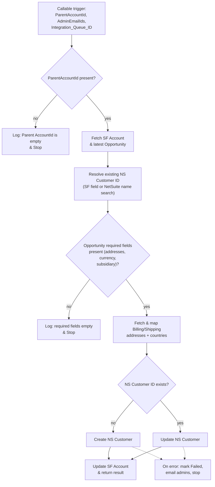

# NS & NF Automation - Callable - Create Parent Customer in Netsuite

## Recipe Overview

This is a **callable child recipe** used to create or update a NetSuite **Customer** record from a Salesforce **Parent Account** (e.g. the top-level account in a hierarchy), pulling addresses, currency and subsidiary data from that Account's latest Opportunity.

Flow: it validates `ParentAccountId` is present, then fetches the Salesforce Account and its latest related Opportunity. It resolves whether the Account already has a NetSuite Customer ID, or tries to find one in NetSuite by exact Company Name match. It then validates that the Opportunity has the required fields (Bill-To/Ship-To addresses, Currency, Subsidiary) — if not, it just logs an error and stops gracefully (no Integration Queue update in this case). If valid, it fetches and maps the Billing/Shipping addresses' countries via the `PROD_NS_Countries` lookup table, then routes to **Create** (if no NetSuite ID) or **Update** (if one exists) the NetSuite Customer, updates the Salesforce Account, and returns a result. Failures during Create/Update mark the `Integration_Queue__c` record as "Failed", optionally email admins, and stop with an error.

## Steps

### Step 0 — Trigger: Callable Execute

- **Name:** Execute (callable recipe trigger)
- **Logic (what it does?):** Entry point invoked by a parent recipe to sync a Parent Account into NetSuite as a Customer.
- **Inputs:** `ParentAccountId`, `AdminEmailIds`, `Integration_Queue_ID`
- **Outputs:** Same as inputs, passed through as recipe parameters
- **Step Number:** 0
- **Previous Step Number:** — (entry point)
- **Next Step Number:** 1

### Step 1 — Validate ParentAccountId Present

- **Name:** IF `ParentAccountId` is present
- **Logic (what it does?):** Checks that a Parent Account ID was actually supplied before doing any work.
- **Inputs:** `ParentAccountId`
- **Outputs:** None (control-flow only)
- **Step Number:** 1
- **Previous Step Number:** 0
- **Next Step Number:** 2 (if present) or 38 (if blank)

### Step 2 — Fetch Salesforce Account

- **Name:** Fetch Parent Account details
- **Logic (what it does?):** Looks up the Salesforce Account matching `ParentAccountId`.
- **Inputs:** `ParentAccountId`
- **Outputs:** Account fields (Name, `Netsuite_Customer_Id__c`, `Email__c`, `SBQQ__TaxExempt__c`, etc.)
- **Step Number:** 2
- **Previous Step Number:** 1
- **Next Step Number:** 3

### Step 3 — Fetch Latest Related Opportunity

- **Name:** Search/Fetch Parent Account Opportunity details
- **Logic (what it does?):** Retrieves the most recent Opportunity linked to this Account, used as the source of addresses, currency, subsidiary, payment method, and contact emails.
- **Inputs:** `ParentAccountId`
- **Outputs:** Opportunity fields (Bill-To/Ship-To address IDs, `CurrencyIsoCode`, `Subsidiary`, `Payment_Method__c`, `Billing_Contact_Email__c`, `Bookstore_Contact_Email__c`, `Labster_Ship_To_Address__c`, `Ubisim_Ship_To_Address__c`, etc.)
- **Step Number:** 3
- **Previous Step Number:** 2
- **Next Step Number:** 4

### Step 4 — Declare NSCustomerInternalId

- **Name:** Create variable `NSCustomerInternalId`
- **Logic (what it does?):** Initializes `NSCustomerInternalId`, defaulting from the Account's `Netsuite_Customer_Id__c` field if already set.
- **Inputs:** Account's `Netsuite_Customer_Id__c` (Step 2)
- **Outputs:** `NSCustomerInternalId`
- **Step Number:** 4
- **Previous Step Number:** 3
- **Next Step Number:** 5

### Step 5 — If No Existing NetSuite ID: Search by Name

- **Name:** IF `NSCustomerInternalId` is blank
- **Logic (what it does?):** If the Account has no NetSuite Customer ID yet, tries to find one in NetSuite by exact Company Name match (Step 6), to prevent duplicates.
- **Inputs:** `NSCustomerInternalId`
- **Outputs:** None (control-flow only)
- **Step Number:** 5
- **Previous Step Number:** 4
- **Next Step Number:** 6 (if blank) or 9 (if already set)

### Step 6 — Search NetSuite Customer by Name

- **Name:** Search Customer in NetSuite
- **Logic (what it does?):** Queries NetSuite for a Customer whose Company Name exactly matches the Salesforce Account Name.
- **Inputs:** Account Name (Step 2)
- **Outputs:** NetSuite Customer `internalId` (if found)
- **Step Number:** 6
- **Previous Step Number:** 5
- **Next Step Number:** 7

### Step 7 — If Found: Store Internal ID

- **Name:** IF a NetSuite Customer was found by name
- **Logic (what it does?):** Branches on whether Step 6 returned a match.
- **Inputs:** Search result from Step 6
- **Outputs:** None (control-flow only)
- **Step Number:** 7
- **Previous Step Number:** 6
- **Next Step Number:** 8 (if found) or 9 (either way, continues)

### Step 8 — Update NSCustomerInternalId Variable

- **Name:** Update variable `NSCustomerInternalId`
- **Logic (what it does?):** Stores the `internalId` found by the name search into `NSCustomerInternalId`.
- **Inputs:** NetSuite `internalId` from Step 6
- **Outputs:** Updated `NSCustomerInternalId`
- **Step Number:** 8
- **Previous Step Number:** 7
- **Next Step Number:** 9

### Step 9 — Validate Opportunity Required Fields

- **Name:** IF Opportunity required fields present (Bill-To Address, Ship-To Address [Labster or UbiSim], Currency, Subsidiary)
- **Logic (what it does?):** Ensures the Account cannot be pushed to NetSuite without a complete Opportunity — checks Bill-To Address, at least one of the two possible Ship-To addresses, Currency, and Subsidiary are present.
- **Inputs:** Opportunity fields from Step 3
- **Outputs:** None (control-flow only)
- **Step Number:** 9
- **Previous Step Number:** 4/5/7/8
- **Next Step Number:** 10 (if valid) or 36 (if invalid)

### Step 10 — Fetch Billing Address

- **Name:** Fetch Account Billing Address
- **Logic (what it does?):** Looks up the Salesforce `Address__c` record for the Opportunity's Bill-To Address.
- **Inputs:** Bill-To Address ID (Step 3)
- **Outputs:** Billing address fields
- **Step Number:** 10
- **Previous Step Number:** 9
- **Next Step Number:** 11

### Step 11 — Fetch Shipping Address

- **Name:** Fetch Account Shipping Address
- **Logic (what it does?):** Looks up the Salesforce `Address__c` record for the Opportunity's Ship-To Address (`Labster_Ship_To_Address__c`, falling back to `Ubisim_Ship_To_Address__c` if blank).
- **Inputs:** Ship-To Address ID (Step 3)
- **Outputs:** Shipping address fields
- **Step Number:** 11
- **Previous Step Number:** 10
- **Next Step Number:** 12

### Step 12 — Map Billing Country to NetSuite

- **Name:** Fetch Account Billing Address Country (lookup table `PROD_NS_Countries`)
- **Logic (what it does?):** Looks up the Salesforce billing country name to get the NetSuite-compatible country API name.
- **Inputs:** Billing address country (Step 10)
- **Outputs:** NetSuite country code/API name for billing
- **Step Number:** 12
- **Previous Step Number:** 11
- **Next Step Number:** 13

### Step 13 — Map Shipping Country to NetSuite

- **Name:** Fetch Account Shipping Address Country (lookup table `PROD_NS_Countries`)
- **Logic (what it does?):** Looks up the Salesforce shipping country name to get the NetSuite-compatible country API name.
- **Inputs:** Shipping address country (Step 11)
- **Outputs:** NetSuite country code/API name for shipping
- **Step Number:** 13
- **Previous Step Number:** 12
- **Next Step Number:** 14

### Step 14 — If NetSuite ID Exists: Update vs Create

- **Name:** IF `NSCustomerInternalId` is blank (create) / present (update)
- **Logic (what it does?):** The core routing decision: create a new NetSuite Customer (Route A) or update the existing one (Route B).
- **Inputs:** `NSCustomerInternalId`
- **Outputs:** None (control-flow only)
- **Step Number:** 14
- **Previous Step Number:** 13
- **Next Step Number:** 15 (Route A — create) or 26 (Route B — update)

### Step 15 — Default Custom Form ID

- **Name:** Declare variable — Default Custom Form ID
- **Logic (what it does?):** Sets `custom_form_id = -2` (NetSuite's default Customer form).
- **Inputs:** None (static)
- **Outputs:** `custom_form_id`
- **Step Number:** 15
- **Previous Step Number:** 14
- **Next Step Number:** 16

### Step 16 — Default Entity Status ID (Closed Won)

- **Name:** Declare variable — Default Entity Status ID (ClosedWon)
- **Logic (what it does?):** Sets `entity_status_id = 13` (Closed Won).
- **Inputs:** None (static)
- **Outputs:** `entity_status_id`
- **Step Number:** 16
- **Previous Step Number:** 15
- **Next Step Number:** 17

### Step 17 — Try: Create NetSuite Customer

- **Name:** `try` wrapping the create path (Steps 18–20)
- **Logic (what it does?):** Wraps the create-customer logic so failures are caught by Step 21.
- **Inputs:** —
- **Outputs:** —
- **Step Number:** 17
- **Previous Step Number:** 16
- **Next Step Number:** 18

### Step 18 — Create NetSuite Customer

- **Name:** Create Customer in NetSuite
- **Logic (what it does?):** Creates a new NetSuite Customer using Account/Opportunity data: Company Name, mapped addresses, Subsidiary, Currency, `custom_form_id`, `entity_status_id`, Tax Exempt mapping, and Email using the fallback hierarchy: `Account.Email__c` → (if Payment Method is "Bookstore") `Bookstore_Contact_Email__c` → `Billing_Contact_Email__c`.
- **Inputs:** Account/Opportunity fields, mapped addresses (Steps 10–13), `custom_form_id`, `entity_status_id`
- **Outputs:** New NetSuite Customer `internalId`
- **Step Number:** 18
- **Previous Step Number:** 17
- **Next Step Number:** 19

### Step 19 — Update Salesforce Account with NetSuite ID

- **Name:** Update the Account
- **Logic (what it does?):** Writes the newly created NetSuite Customer's `internalId` onto the Salesforce Account's `Netsuite_Customer_Id__c` field.
- **Inputs:** `ParentAccountId`, new NetSuite `internalId`
- **Outputs:** Updated Salesforce Account
- **Step Number:** 19
- **Previous Step Number:** 18
- **Next Step Number:** 20

### Step 20 — Return Result (Create)

- **Name:** Return Response: Create Parent Customer in Netsuite
- **Logic (what it does?):** Returns `"Successfully created Customer in Netsuite"` and `NSParentCustomerInternalId` to the calling recipe.
- **Inputs:** New NetSuite `internalId`
- **Outputs:** `Message`, `NSParentCustomerInternalId`
- **Step Number:** 20
- **Previous Step Number:** 19
- **Next Step Number:** 40 (recipe end)

### Step 21 — Catch: Create Failed

- **Name:** `catch` block for Step 17
- **Logic (what it does?):** Handles any failure while creating the NetSuite Customer (Steps 22–25).
- **Inputs:** Caught error type/message
- **Outputs:** —
- **Step Number:** 21
- **Previous Step Number:** 18–20 (on error)
- **Next Step Number:** 22

### Step 22 — If Email Deliverability: Notify Admins (Create Failure)

- **Name:** IF `EmailDeliverability` account property is true
- **Logic (what it does?):** Decides whether to send a failure notification email.
- **Inputs:** Account property `EmailDeliverability`
- **Outputs:** None (control-flow only)
- **Step Number:** 22
- **Previous Step Number:** 21
- **Next Step Number:** 23 (if true) or 24 (if false)

### Step 23 — Email Admins (Create Failure)

- **Name:** Send mail "If failed to create NS Customer then send a mail to admin"
- **Logic (what it does?):** Emails `AdminEmailIds` with recipe/job IDs and error details.
- **Inputs:** `AdminEmailIds`, job context, caught error
- **Outputs:** Email sent
- **Step Number:** 23
- **Previous Step Number:** 22
- **Next Step Number:** 24

### Step 24 — Mark Integration Queue Failed (Create)

- **Name:** Update Integration Queue: "If failed to create NS Customer then update Integration Queue record"
- **Logic (what it does?):** Sets `Processed_Flag__c = "Failed"` with the error trace.
- **Inputs:** `Integration_Queue_ID`, caught error
- **Outputs:** Updated Salesforce record
- **Step Number:** 24
- **Previous Step Number:** 22 or 23
- **Next Step Number:** 25

### Step 25 — Stop with Error (Create Failed)

- **Name:** Stop ("Failed to create Parent Customer in Netsuite")
- **Logic (what it does?):** Ends the recipe run with an error.
- **Inputs:** —
- **Outputs:** —
- **Step Number:** 25
- **Previous Step Number:** 24
- **Next Step Number:** — (end of recipe, error)

### Step 26 — Route B: Else — Try Update NetSuite Customer

- **Name:** `else` branch of Step 14 → `try` wrapping the update path (Steps 28–30)
- **Logic (what it does?):** Taken when `NSCustomerInternalId` already exists; wraps the update logic so failures are caught by Step 31.
- **Inputs:** —
- **Outputs:** —
- **Step Number:** 26
- **Previous Step Number:** 14
- **Next Step Number:** 27

### Step 27 — Try Block

- **Name:** `try` (nested)
- **Logic (what it does?):** Wraps Steps 28–30.
- **Inputs:** —
- **Outputs:** —
- **Step Number:** 27
- **Previous Step Number:** 26
- **Next Step Number:** 28

### Step 28 — Update NetSuite Customer

- **Name:** Update the Customer
- **Logic (what it does?):** Updates the existing NetSuite Customer (`NSCustomerInternalId`) with the mapped addresses, currency, subsidiary and email (same fallback hierarchy as Step 18) and Tax Exempt mapping.
- **Inputs:** `NSCustomerInternalId`, Account/Opportunity fields, mapped addresses
- **Outputs:** Updated NetSuite Customer record
- **Step Number:** 28
- **Previous Step Number:** 27
- **Next Step Number:** 29

### Step 29 — Update Salesforce Account

- **Name:** Update the Account
- **Logic (what it does?):** Updates the Salesforce Account (e.g. to keep sync timestamps/logs fresh, confirming the NetSuite ID link).
- **Inputs:** `ParentAccountId`, `NSCustomerInternalId`
- **Outputs:** Updated Salesforce Account
- **Step Number:** 29
- **Previous Step Number:** 28
- **Next Step Number:** 30

### Step 30 — Return Result (Update)

- **Name:** Return Response: Update Parent Customer in Netsuite
- **Logic (what it does?):** Returns `"Successfully updated Parent Customer in Netsuite"` and `NSParentCustomerInternalId` to the calling recipe.
- **Inputs:** `NSCustomerInternalId`
- **Outputs:** `Message`, `NSParentCustomerInternalId`
- **Step Number:** 30
- **Previous Step Number:** 29
- **Next Step Number:** 40 (recipe end)

### Step 31 — Catch: Update Failed

- **Name:** `catch` block for Step 26/27
- **Logic (what it does?):** Handles any failure while updating the NetSuite Customer (Steps 32–35).
- **Inputs:** Caught error type/message
- **Outputs:** —
- **Step Number:** 31
- **Previous Step Number:** 28–30 (on error)
- **Next Step Number:** 32

### Step 32 — If Email Deliverability: Notify Admins (Update Failure)

- **Name:** IF `EmailDeliverability` account property is true
- **Logic (what it does?):** Decides whether to send a failure notification email for the update path.
- **Inputs:** Account property `EmailDeliverability`
- **Outputs:** None (control-flow only)
- **Step Number:** 32
- **Previous Step Number:** 31
- **Next Step Number:** 33 (if true) or 34 (if false)

### Step 33 — Email Admins (Update Failure)

- **Name:** Send mail "If failed to update NS Customer then send a mail to admin"
- **Logic (what it does?):** Emails `AdminEmailIds` with recipe/job IDs and error details.
- **Inputs:** `AdminEmailIds`, job context, caught error
- **Outputs:** Email sent
- **Step Number:** 33
- **Previous Step Number:** 32
- **Next Step Number:** 34

### Step 34 — Mark Integration Queue Failed (Update)

- **Name:** Update Integration Queue: "If failed to create NS Customer then update Integration Queue record" *(wording reuses "create" text from the source recipe — likely a copy/paste artifact)*
- **Logic (what it does?):** Sets `Processed_Flag__c = "Failed"` with the error trace.
- **Inputs:** `Integration_Queue_ID`, caught error
- **Outputs:** Updated Salesforce record
- **Step Number:** 34
- **Previous Step Number:** 32 or 33
- **Next Step Number:** 35

### Step 35 — Stop with Error (Update Failed)

- **Name:** Stop ("Failed to update Parent Customer in Netsuite")
- **Logic (what it does?):** Ends the recipe run with an error.
- **Inputs:** —
- **Outputs:** —
- **Step Number:** 35
- **Previous Step Number:** 34
- **Next Step Number:** — (end of recipe, error)

### Step 36 — Else: Opportunity Fields Missing

- **Name:** `else` branch of Step 9
- **Logic (what it does?):** Taken when the Opportunity is missing required fields (addresses, currency, subsidiary).
- **Inputs:** —
- **Outputs:** —
- **Step Number:** 36
- **Previous Step Number:** 9
- **Next Step Number:** 37

### Step 37 — Log: Opportunity Required Fields Empty

- **Name:** Log message "Salesforce Opportunity required fields are empty."
- **Logic (what it does?):** Logs the issue to the job report. **Note:** unlike other failure paths in this recipe, this branch does **not** update the `Integration_Queue__c` record or send an admin email — it only logs and (implicitly) proceeds to the final Stop.
- **Inputs:** —
- **Outputs:** Job report log entry
- **Step Number:** 37
- **Previous Step Number:** 36
- **Next Step Number:** 40 (recipe end)

### Step 38 — Else: ParentAccountId Empty

- **Name:** `else` branch of Step 1
- **Logic (what it does?):** Taken when `ParentAccountId` was not supplied.
- **Inputs:** —
- **Outputs:** —
- **Step Number:** 38
- **Previous Step Number:** 1
- **Next Step Number:** 39

### Step 39 — Log: Parent AccountId Empty

- **Name:** Log message "Parent AccountId is empty"
- **Logic (what it does?):** Logs the issue to the job report. **Note:** as with Step 37, this branch does not update the Integration Queue or send an email — it only logs.
- **Inputs:** —
- **Outputs:** Job report log entry
- **Step Number:** 39
- **Previous Step Number:** 38
- **Next Step Number:** 40 (recipe end)

### Step 40 — Stop

- **Name:** Stop
- **Logic (what it does?):** Final stop reached after any of the successful return paths (Step 20 or 30) or the logged-and-skipped validation failures (Step 37 or 39).
- **Inputs:** —
- **Outputs:** —
- **Step Number:** 40
- **Previous Step Number:** 20, 30, 37, or 39
- **Next Step Number:** — (end of recipe)

## Key Business Logic Notes

- **Intelligent Email Routing:** Fallback hierarchy for the NetSuite Customer email: `Account.Email__c` → (if `Payment_Method__c == "Bookstore"`) `Bookstore_Contact_Email__c` → `Billing_Contact_Email__c`.
- **Dynamic Shipping Address Selection:** Uses `Labster_Ship_To_Address__c` on the Opportunity first; falls back to `Ubisim_Ship_To_Address__c` if blank — supports multi-product shipping.
- **Tax Exemption Mapping:** If `SBQQ__TaxExempt__c == "Yes"`, NetSuite `taxable` is explicitly set to `"No"`.
- **Silent Validation Failures:** Unlike the missing-`ParentAccountId` and missing-Opportunity-fields checks (Steps 1 and 9), which only log a message and stop gracefully without touching Salesforce, the NetSuite Create/Update failures (Steps 21, 31) do update the `Integration_Queue__c` record and notify admins. This asymmetry is worth flagging/aligning during the n8n migration.
- **Duplicate Prevention:** Checks both the Salesforce `Netsuite_Customer_Id__c` field and a NetSuite name-based search before creating a new Customer, same pattern as the (non-parent) Create Customer recipe.
