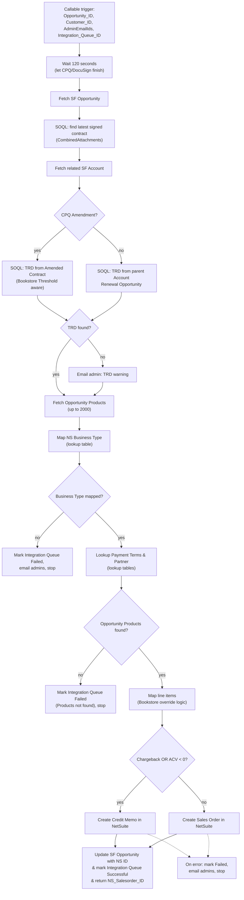

# NS & NF Automation - Callable - Create Sales Order Credit Memo in NetSuite with Delay

## Recipe Overview

This is a **callable child recipe** that creates the final NetSuite financial transaction (a **Sales Order** or a **Credit Memo**) for a Salesforce Opportunity, once its Customer (and optionally Parent Customer / Contacts) already exist in NetSuite.

Flow: it starts with an intentional **2-minute delay** to let upstream CPQ/DocuSign processes finish attaching the signed contract to Salesforce. It then fetches the Opportunity, looks for the latest signed/executed contract document (via SOQL over `CombinedAttachments`), and fetches the related Account. It computes the **Target Renewal Date (TRD)** differently depending on whether the Opportunity is a CPQ Amendment (traversing to the Amended Contract's Renewal Opportunity, with special handling for "Bookstore Threshold" deals) or a new deal (traversing to the parent Account's Renewal Opportunity) — sending a warning email if no TRD can be found. It fetches up to 2,000 Opportunity Products, validates and maps the NetSuite Business Type (stopping with an error if unmapped), and resolves Payment Terms and Partner lookups. If there are Opportunity Products, it maps each line item — using `Bookstore_Quantity__c`/`Total_Bookstore_Price__c` instead of standard Quantity/Price when `Payment_Method__c = "Bookstore"` — and then branches: if the deal is flagged as a `Chargeback` or has negative `ACV_Sum__c`, it creates a **Credit Memo**; otherwise it creates a standard **Sales Order**. Either way, it looks up the created NetSuite record, writes the NetSuite ID/number back onto the Salesforce Opportunity, marks the Integration Queue "Successful", and returns the NetSuite transaction ID. Any failure (including missing Products) marks the Integration Queue "Failed", optionally emails admins, and stops with an error.

## Steps

### Step 0 — Trigger: Callable Execute

- **Name:** Execute (callable recipe trigger)
- **Logic (what it does?):** Entry point invoked by the Sales Automation orchestrator recipe once a NetSuite Customer exists.
- **Inputs:** `Opportunity_ID`, `Customer_ID`, `AdminEmailIds`, `Integration_Queue_ID`
- **Outputs:** Same as inputs, passed through as recipe parameters
- **Step Number:** 0
- **Previous Step Number:** — (entry point)
- **Next Step Number:** 1

### Step 1 — Wait 120 Seconds

- **Name:** Wait for interval (clock)
- **Logic (what it does?):** Intentional 2-minute delay to avoid race conditions with upstream CPQ generation and DocuSign writebacks, ensuring the signed contract PDF is attached before proceeding.
- **Inputs:** `interval: 120` (seconds)
- **Outputs:** —
- **Step Number:** 1
- **Previous Step Number:** 0
- **Next Step Number:** 2

### Step 2 — Fetch Salesforce Opportunity

- **Name:** Search for Opportunities in Salesforce
- **Logic (what it does?):** Looks up the Opportunity by `Opportunity_ID`, retrieving fields needed throughout the recipe (currency, subsidiary, business type, chargeback flag, ACV, payment method, record type, etc.).
- **Inputs:** `Opportunity_ID`
- **Outputs:** Opportunity fields
- **Step Number:** 2
- **Previous Step Number:** 1
- **Next Step Number:** 3

### Step 3 — Declare docusign_file_link Variable

- **Name:** Create variable `docusign_file_link`
- **Logic (what it does?):** Initializes an empty/default variable to hold the found contract document URL.
- **Inputs:** None
- **Outputs:** `docusign_file_link`
- **Step Number:** 3
- **Previous Step Number:** 2
- **Next Step Number:** 4

### Step 4 — SOQL: Find Signed Contract Document

- **Name:** Search Opportunity + related `CombinedAttachments` via custom SOQL
- **Logic (what it does?):** Runs a SOQL query looking for the most recently modified attachment on the Opportunity's related Quote whose title matches signed-contract naming conventions (`*_Completed.pdf`, `* Fully Executed`, `* Completed *`) — "lookup the latest signed/executed contract document for this Opportunity".
- **Inputs:** `Opportunity_ID`, related Quote name
- **Outputs:** Attachment `Id`, `Title` (if found)
- **Step Number:** 4
- **Previous Step Number:** 3
- **Next Step Number:** 5

### Step 5 — If Contract Document Found

- **Name:** IF attachment `Id` is present
- **Logic (what it does?):** Branches on whether Step 4 found a matching document.
- **Inputs:** Step 4 result
- **Outputs:** None (control-flow only)
- **Step Number:** 5
- **Previous Step Number:** 4
- **Next Step Number:** 6 (if found) or 7 (either way, continues)

### Step 6 — Store DocuSign File Link

- **Name:** Update variable `docusign_file_link`
- **Logic (what it does?):** Stores the found attachment's link/ID into `docusign_file_link` for later reference.
- **Inputs:** Attachment `Id` from Step 4
- **Outputs:** Updated `docusign_file_link`
- **Step Number:** 6
- **Previous Step Number:** 5
- **Next Step Number:** 7

### Step 7 — Fetch Related Account (Segment & Region)

- **Name:** Search Opportunity related Account (Account Segment & Region)
- **Logic (what it does?):** Looks up the Opportunity's Account to retrieve segment and geography fields used later on the NetSuite transaction.
- **Inputs:** Opportunity's `AccountId`
- **Outputs:** Account segment/region fields
- **Step Number:** 7
- **Previous Step Number:** 5 or 6
- **Next Step Number:** 8

### Step 8 — Lookup Opportunity Record Type

- **Name:** Search entries in `PROD-Opportunity_RecordType` lookup table
- **Logic (what it does?):** Determines whether the Opportunity's record type corresponds to "CPQ Amendment" or something else, driving the TRD calculation branch below.
- **Inputs:** Opportunity record type
- **Outputs:** Lookup table entry (`col1`/`col2` classification)
- **Step Number:** 8
- **Previous Step Number:** 7
- **Next Step Number:** 9

### Step 9 — Declare Target Renewal Date Variable

- **Name:** Create variable `Target Renewal Date`
- **Logic (what it does?):** Initializes the TRD variable, to be populated by one of the branches below.
- **Inputs:** None
- **Outputs:** `Target Renewal Date` (initially blank)
- **Step Number:** 9
- **Previous Step Number:** 8
- **Next Step Number:** 10

### Step 10 — If CPQ Amendment: Branch on Bookstore Threshold

- **Name:** IF Opportunity Record Type = "CPQ Amendment" (from Step 8 lookup)
- **Logic (what it does?):** If this is a CPQ Amendment, further branches (Step 11) on whether it's a "Bookstore Threshold" deal, since the TRD lookup path differs slightly. If not an Amendment, goes to Step 17 (else) to look up the TRD via the parent Account's Renewal Opportunity instead.
- **Inputs:** Lookup table classification (Step 8)
- **Outputs:** None (control-flow only)
- **Step Number:** 10
- **Previous Step Number:** 9
- **Next Step Number:** 11 (if Amendment) or 17 (if not)

### Step 11 — If Not Bookstore Threshold

- **Name:** IF `Bookstore_Threshold_Opportunity__c` is not true
- **Logic (what it does?):** Within the Amendment branch, distinguishes the standard Amendment TRD lookup (Step 12) from the Bookstore-Threshold-specific variant (Step 14 else).
- **Inputs:** Opportunity `Bookstore_Threshold_Opportunity__c`
- **Outputs:** None (control-flow only)
- **Step Number:** 11
- **Previous Step Number:** 10
- **Next Step Number:** 12 (if not threshold) or 14 (if threshold)

### Step 12 — SOQL: TRD from Amended Contract

- **Name:** Custom SOQL query — "lookup Target Renewal Date via the Amended Contract's Renewal Opportunity"
- **Logic (what it does?):** Traverses from the Opportunity to its Amended Contract, then to that Contract's Renewal Opportunity, to fetch the TRD field.
- **Inputs:** Opportunity's related Amended Contract reference
- **Outputs:** TRD value (if found)
- **Step Number:** 12
- **Previous Step Number:** 11
- **Next Step Number:** 13

### Step 13 — Store TRD (Amendment, Non-Threshold)

- **Name:** Update variable `Target Renewal Date`
- **Logic (what it does?):** Stores the TRD found in Step 12.
- **Inputs:** TRD from Step 12
- **Outputs:** Updated `Target Renewal Date`
- **Step Number:** 13
- **Previous Step Number:** 12
- **Next Step Number:** 20

### Step 14 — Else: Bookstore Threshold Amendment

- **Name:** `else` branch of Step 11
- **Logic (what it does?):** Taken when the Amendment is a Bookstore Threshold deal, requiring a slightly different SOQL traversal (Step 15) to find the TRD.
- **Inputs:** —
- **Outputs:** —
- **Step Number:** 14
- **Previous Step Number:** 11
- **Next Step Number:** 15

### Step 15 — SOQL: TRD from Amended Contract (Bookstore Threshold Variant)

- **Name:** Custom SOQL query — TRD lookup, Bookstore Threshold variant
- **Logic (what it does?):** Same idea as Step 12 but adjusted for the Bookstore Threshold Opportunity's specific relationship path.
- **Inputs:** Opportunity's related Amended Contract reference
- **Outputs:** TRD value (if found)
- **Step Number:** 15
- **Previous Step Number:** 14
- **Next Step Number:** 16

### Step 16 — Store TRD (Amendment, Bookstore Threshold)

- **Name:** Update variable `Target Renewal Date`
- **Logic (what it does?):** Stores the TRD found in Step 15.
- **Inputs:** TRD from Step 15
- **Outputs:** Updated `Target Renewal Date`
- **Step Number:** 16
- **Previous Step Number:** 15
- **Next Step Number:** 20

### Step 17 — Else: Not an Amendment

- **Name:** `else` branch of Step 10
- **Logic (what it does?):** Taken when the Opportunity is not a CPQ Amendment (a brand-new deal); looks up the TRD via the parent Account's Renewal Opportunity instead (Step 18).
- **Inputs:** —
- **Outputs:** —
- **Step Number:** 17
- **Previous Step Number:** 10
- **Next Step Number:** 18

### Step 18 — SOQL: TRD from Parent Account Renewal Opportunity

- **Name:** Custom SOQL query — "lookup Target Renewal Date via the parent Account's Renewal Opportunity"
- **Logic (what it does?):** Traverses from the Account to its Renewal Opportunity to fetch the TRD field, for non-amendment deals.
- **Inputs:** Opportunity's related Account
- **Outputs:** TRD value (if found)
- **Step Number:** 18
- **Previous Step Number:** 17
- **Next Step Number:** 19

### Step 19 — Store TRD (Non-Amendment)

- **Name:** Update variable `Target Renewal Date`
- **Logic (what it does?):** Stores the TRD found in Step 18.
- **Inputs:** TRD from Step 18
- **Outputs:** Updated `Target Renewal Date`
- **Step Number:** 19
- **Previous Step Number:** 18
- **Next Step Number:** 20

### Step 20 — If TRD Still Missing: Warn Admin

- **Name:** IF TRD lookup result is blank AND `EmailDeliverability` is true (and record type condition)
- **Logic (what it does?):** Failsafe — if none of the branches above could establish a Target Renewal Date, sends a warning email to admins. This does **not** stop the recipe; it's advisory only.
- **Inputs:** TRD lookup results (Steps 12/15/18), account property `EmailDeliverability`
- **Outputs:** None (control-flow only)
- **Step Number:** 20
- **Previous Step Number:** 13, 16, or 19
- **Next Step Number:** 21 (if condition true) or 22 (either way, continues)

### Step 21 — Email Admin (TRD Warning)

- **Name:** Send mail (TRD not found warning)
- **Logic (what it does?):** Emails admins warning that no Target Renewal Date could be determined for this Opportunity.
- **Inputs:** `AdminEmailIds`, Opportunity/job context
- **Outputs:** Email sent
- **Step Number:** 21
- **Previous Step Number:** 20
- **Next Step Number:** 22

### Step 22 — Fetch Opportunity Products

- **Name:** Search for Opportunity Products in Salesforce
- **Logic (what it does?):** Retrieves up to 2,000 `OpportunityLineItem` records associated with the Opportunity.
- **Inputs:** `Opportunity_ID`
- **Outputs:** Opportunity Products list (up to 2000), incl. `Netsuite_Item_Id__c`, Quantity, pricing, `Bookstore_Quantity__c`, `Total_Bookstore_Price__c`
- **Step Number:** 22
- **Previous Step Number:** 20 or 21
- **Next Step Number:** 23

### Step 23 — Lookup NetSuite Business Type

- **Name:** Search Opportunity Business Type (lookup table `PROD_NS_Business_Type`)
- **Logic (what it does?):** Maps the Opportunity's `Business__c` field to its NetSuite Business Type internal ID.
- **Inputs:** Opportunity `Business__c`
- **Outputs:** NetSuite Business Type ID (if mapped)
- **Step Number:** 23
- **Previous Step Number:** 22
- **Next Step Number:** 24

### Step 24 — Declare NS_business_type_id Variable

- **Name:** Create variable `NS_business_type_id`
- **Logic (what it does?):** Stores the result of the Business Type lookup (Step 23) into a variable for validation.
- **Inputs:** Lookup result from Step 23
- **Outputs:** `NS_business_type_id`
- **Step Number:** 24
- **Previous Step Number:** 23
- **Next Step Number:** 25

### Step 25 — Validate Business Type Mapped

- **Name:** IF `NS_business_type_id` is blank ("If Opportunity Business Type not found in the LU Table then return error")
- **Logic (what it does?):** A strict synchronization gate — if the Opportunity's Business Type isn't explicitly mapped in the lookup table, the transaction halts immediately rather than pushing unmapped data to NetSuite.
- **Inputs:** `NS_business_type_id`
- **Outputs:** None (control-flow only)
- **Step Number:** 25
- **Previous Step Number:** 24
- **Next Step Number:** 26 (if blank/invalid) or 30 (if valid)

### Step 26 — If Email Deliverability: Notify Admins (Business Type)

- **Name:** IF `EmailDeliverability` account property is true
- **Logic (what it does?):** Decides whether to send a failure notification email.
- **Inputs:** Account property `EmailDeliverability`
- **Outputs:** None (control-flow only)
- **Step Number:** 26
- **Previous Step Number:** 25
- **Next Step Number:** 27 (if true) or 28 (if false)

### Step 27 — Email Admins (Business Type Not Mapped)

- **Name:** Send error mail to admin
- **Logic (what it does?):** Emails `AdminEmailIds` that the Opportunity's Business Type is unmapped.
- **Inputs:** `AdminEmailIds`, Opportunity `Business__c`
- **Outputs:** Email sent
- **Step Number:** 27
- **Previous Step Number:** 26
- **Next Step Number:** 28

### Step 28 — Mark Integration Queue Failed (Business Type)

- **Name:** Update Integration Queue: "If Opportunity Business Type not found in the LU Table then update Integration Queue record"
- **Logic (what it does?):** Sets `Processed_Flag__c = "Failed"`.
- **Inputs:** `Integration_Queue_ID`
- **Outputs:** Updated Salesforce record
- **Step Number:** 28
- **Previous Step Number:** 26 or 27
- **Next Step Number:** 29

### Step 29 — Stop with Error (Business Type Not Allowed)

- **Name:** Stop ("Opportunity Type not allowed to create SalesOrder in Netsuite")
- **Logic (what it does?):** Ends the recipe run with an error.
- **Inputs:** —
- **Outputs:** —
- **Step Number:** 29
- **Previous Step Number:** 28
- **Next Step Number:** — (end of recipe, error)

### Step 30 — Lookup NetSuite Payment Terms

- **Name:** Search Payment Terms (lookup table)
- **Logic (what it does?):** Maps the Opportunity/Account payment terms to their NetSuite internal ID.
- **Inputs:** Opportunity/Account payment terms field
- **Outputs:** NetSuite Payment Terms ID
- **Step Number:** 30
- **Previous Step Number:** 25
- **Next Step Number:** 31

### Step 31 — Lookup NetSuite Partner

- **Name:** Search entries in `PROD Partner Accounts` lookup table
- **Logic (what it does?):** Maps the Opportunity's partner reference to its NetSuite internal ID.
- **Inputs:** Opportunity partner field
- **Outputs:** NetSuite Partner ID
- **Step Number:** 31
- **Previous Step Number:** 30
- **Next Step Number:** 32

### Step 32 — Declare SFOpportunityProducts List

- **Name:** Create variable list `SFOpportunityProducts`
- **Logic (what it does?):** Initializes an empty list to hold the mapped line items destined for NetSuite.
- **Inputs:** None
- **Outputs:** `SFOpportunityProducts` (empty list)
- **Step Number:** 32
- **Previous Step Number:** 31
- **Next Step Number:** 33

### Step 33 — If Opportunity Products Exist

- **Name:** IF Opportunity Product list size > 0
- **Logic (what it does?):** Only proceeds to build the NetSuite transaction if there's at least one product line; otherwise treats it as a failure (Step 56 else).
- **Inputs:** Opportunity Products list size (Step 22)
- **Outputs:** None (control-flow only)
- **Step Number:** 33
- **Previous Step Number:** 32
- **Next Step Number:** 34 (if products exist) or 56 (if none)

### Step 34 — Try: Build Transaction

- **Name:** `try` wrapping the whole transaction-creation logic (Steps 35–50)
- **Logic (what it does?):** Wraps the Credit Memo / Sales Order creation so any failure is caught by Step 51.
- **Inputs:** —
- **Outputs:** —
- **Step Number:** 34
- **Previous Step Number:** 33
- **Next Step Number:** 35

### Step 35 — Determine Transaction Type: Chargeback or Negative ACV?

- **Name:** IF Opportunity `oppmgmt_Chargeback__c = true` OR `ACV_Sum__c < 0`
- **Logic (what it does?):** The core routing decision — automatically switches to generating a Credit Memo instead of a Sales Order when the deal is a chargeback or has negative ACV, removing the need for manual transaction-type selection.
- **Inputs:** Opportunity `oppmgmt_Chargeback__c`, `ACV_Sum__c`
- **Outputs:** None (control-flow only)
- **Step Number:** 35
- **Previous Step Number:** 34
- **Next Step Number:** 36 (Credit Memo path) or 43 (Sales Order path)

### Step 36 — For Each Product: Map Line Item (Credit Memo)

- **Name:** `foreach` over Opportunity Products → map into `SFOpportunityProducts`
- **Logic (what it does?):** For each product, appends a mapped line item (Step 37) to the list used to build the Credit Memo.
- **Inputs:** Opportunity Products (Step 22)
- **Outputs:** `SFOpportunityProducts` list
- **Step Number:** 36
- **Previous Step Number:** 35
- **Next Step Number:** 37

### Step 37 — Map Line Item (Bookstore Override Logic)

- **Name:** Insert item to list — "If Opportunity PaymentMethod is Bookstore then store the BookstoreQuantity else store Quantity field value"
- **Logic (what it does?):** Builds one line item entry: `Item_ID` = `Netsuite_Item_Id__c`; `Quantity`/amount = `Bookstore_Quantity__c`/`Total_Bookstore_Price__c` when `Payment_Method__c == "Bookstore"` (and Payment Method Details match), otherwise the standard Quantity/price fields.
- **Inputs:** Current product line (Step 36), Opportunity `Payment_Method__c`/`Payment_Method_Details__c`
- **Outputs:** One entry appended to `SFOpportunityProducts`
- **Step Number:** 37
- **Previous Step Number:** 36
- **Next Step Number:** 38 (after loop completes)

### Step 38 — Create Credit Memo in NetSuite

- **Name:** Create Credit memo in NetSuite
- **Logic (what it does?):** Creates a NetSuite `CreditMemo` record using `Customer_ID` (entity), currency, subsidiary, transaction date, business type, payment terms, partner, TRD, and the mapped `SFOpportunityProducts` line items.
- **Inputs:** `Customer_ID`, Opportunity fields, `NS_business_type_id`, Payment Terms/Partner IDs, `Target Renewal Date`, `SFOpportunityProducts`
- **Outputs:** New NetSuite Credit Memo `internal_id`
- **Step Number:** 38
- **Previous Step Number:** 36–37 (loop)
- **Next Step Number:** 39

### Step 39 — Search Created Credit Memo

- **Name:** Search Credit memos in NetSuite
- **Logic (what it does?):** Re-queries NetSuite for the just-created Credit Memo by `internal_id` to retrieve its transaction number (`tranId`).
- **Inputs:** Credit Memo `internal_id` (Step 38)
- **Outputs:** Credit Memo `internal_id`, `tranId`
- **Step Number:** 39
- **Previous Step Number:** 38
- **Next Step Number:** 40

### Step 40 — Update SF Opportunity with Credit Memo Reference

- **Name:** Update with SalesOrder Number and InternalId
- **Logic (what it does?):** Writes `Netsuite_SalesOrder_Id__c` and `Netsuite_SalesOrder_Number__c` on the Opportunity with the Credit Memo's `internal_id`/`tranId` (field names are shared/reused for both transaction types).
- **Inputs:** `Opportunity_ID`, Credit Memo `internal_id`/`tranId` (Step 39)
- **Outputs:** Updated Salesforce Opportunity
- **Step Number:** 40
- **Previous Step Number:** 39
- **Next Step Number:** 41

### Step 41 — Mark Integration Queue Successful (Credit Memo)

- **Name:** Add success message in the Integration Queue record
- **Logic (what it does?):** Sets `Processed_Flag__c = "Successful"` with a message naming the transaction type created (from the Business Type lookup entry).
- **Inputs:** `Integration_Queue_ID`, Business Type lookup entry
- **Outputs:** Updated Salesforce record
- **Step Number:** 41
- **Previous Step Number:** 40
- **Next Step Number:** 42

### Step 42 — Return Result (Credit Memo)

- **Name:** Return Response: NS Salesorder ID
- **Logic (what it does?):** Returns the Credit Memo's `internal_id` as `NS_Salesorder_ID` to the calling recipe.
- **Inputs:** Credit Memo `internal_id` (Step 39)
- **Outputs:** `NS_Salesorder_ID`
- **Step Number:** 42
- **Previous Step Number:** 41
- **Next Step Number:** 61 (recipe end)

### Step 43 — Else: Sales Order Path

- **Name:** `else` branch of Step 35
- **Logic (what it does?):** Taken when the deal is a standard positive-value transaction (not a chargeback, non-negative ACV).
- **Inputs:** —
- **Outputs:** —
- **Step Number:** 43
- **Previous Step Number:** 35
- **Next Step Number:** 44

### Step 44 — For Each Product: Map Line Item (Sales Order)

- **Name:** `foreach` over Opportunity Products → map into `SFOpportunityProducts`
- **Logic (what it does?):** Same mapping loop as Step 36, but building line items for the Sales Order instead.
- **Inputs:** Opportunity Products (Step 22)
- **Outputs:** `SFOpportunityProducts` list
- **Step Number:** 44
- **Previous Step Number:** 43
- **Next Step Number:** 45

### Step 45 — Map Line Item (Bookstore Override Logic)

- **Name:** Insert item to list — same Bookstore override logic as Step 37
- **Logic (what it does?):** Builds one line item entry using Bookstore quantity/price fields when applicable, otherwise standard fields.
- **Inputs:** Current product line (Step 44), Opportunity `Payment_Method__c`/`Payment_Method_Details__c`
- **Outputs:** One entry appended to `SFOpportunityProducts`
- **Step Number:** 45
- **Previous Step Number:** 44
- **Next Step Number:** 46 (after loop completes)

### Step 46 — Create Sales Order in NetSuite

- **Name:** Create Sales order in NetSuite
- **Logic (what it does?):** Creates a NetSuite `SalesOrder` record with an extensive set of custom body fields (payment method, SFDC Opportunity ID, collaboration, business type, returning business flag, target renewal date, account segment/geography, billing email contact, etc.), plus `Customer_ID`, currency, subsidiary, and the mapped line items.
- **Inputs:** `Customer_ID`, Opportunity/Account fields, `NS_business_type_id`, Payment Terms/Partner IDs, `Target Renewal Date`, `SFOpportunityProducts`
- **Outputs:** New NetSuite Sales Order `internal_id`
- **Step Number:** 46
- **Previous Step Number:** 44–45 (loop)
- **Next Step Number:** 47

### Step 47 — Search Created Sales Order

- **Name:** Search Sales orders in NetSuite
- **Logic (what it does?):** Re-queries NetSuite for the just-created Sales Order by `internal_id` to retrieve its transaction number (`tranId`).
- **Inputs:** Sales Order `internal_id` (Step 46)
- **Outputs:** Sales Order `internal_id`, `tranId`
- **Step Number:** 47
- **Previous Step Number:** 46
- **Next Step Number:** 48

### Step 48 — Update SF Opportunity with Sales Order Reference

- **Name:** Update with SalesOrder Number and InternalId
- **Logic (what it does?):** Writes `Netsuite_SalesOrder_Id__c` and `Netsuite_SalesOrder_Number__c` on the Opportunity with the Sales Order's `internal_id`/`tranId`.
- **Inputs:** `Opportunity_ID`, Sales Order `internal_id`/`tranId` (Step 47)
- **Outputs:** Updated Salesforce Opportunity
- **Step Number:** 48
- **Previous Step Number:** 47
- **Next Step Number:** 49

### Step 49 — Mark Integration Queue Successful (Sales Order)

- **Name:** Add success message in the Integration Queue record
- **Logic (what it does?):** Sets `Processed_Flag__c = "Successful"` with a message naming the transaction type created.
- **Inputs:** `Integration_Queue_ID`, Business Type lookup entry
- **Outputs:** Updated Salesforce record
- **Step Number:** 49
- **Previous Step Number:** 48
- **Next Step Number:** 50

### Step 50 — Return Result (Sales Order)

- **Name:** Return Response: NS Salesorder ID
- **Logic (what it does?):** Returns the Sales Order's `internal_id` as `NS_Salesorder_ID` to the calling recipe.
- **Inputs:** Sales Order `internal_id` (Step 47)
- **Outputs:** `NS_Salesorder_ID`
- **Step Number:** 50
- **Previous Step Number:** 49
- **Next Step Number:** 61 (recipe end)

### Step 51 — Catch: Transaction Creation Failed

- **Name:** `catch` block for Step 34
- **Logic (what it does?):** Handles any failure while creating the Credit Memo/Sales Order (Steps 52–55).
- **Inputs:** Caught error type/message
- **Outputs:** —
- **Step Number:** 51
- **Previous Step Number:** 36–50 (on error)
- **Next Step Number:** 52

### Step 52 — If Email Deliverability: Notify Admins (Transaction Failure)

- **Name:** IF `EmailDeliverability` account property is true
- **Logic (what it does?):** Decides whether to send a failure notification email.
- **Inputs:** Account property `EmailDeliverability`
- **Outputs:** None (control-flow only)
- **Step Number:** 52
- **Previous Step Number:** 51
- **Next Step Number:** 53 (if true) or 54 (if false)

### Step 53 — Email Admins (Transaction Failure)

- **Name:** Send mail "If failed to create NS Salesorder then send a mail to admin"
- **Logic (what it does?):** Emails `AdminEmailIds` with recipe/job IDs and error details.
- **Inputs:** `AdminEmailIds`, job context, caught error
- **Outputs:** Email sent
- **Step Number:** 53
- **Previous Step Number:** 52
- **Next Step Number:** 54

### Step 54 — Mark Integration Queue Failed (Transaction)

- **Name:** Update Integration Queue: "If failed to create NS Sales Order then update Integration Queue record"
- **Logic (what it does?):** Sets `Processed_Flag__c = "Failed"` with the error trace.
- **Inputs:** `Integration_Queue_ID`, caught error
- **Outputs:** Updated Salesforce record
- **Step Number:** 54
- **Previous Step Number:** 52 or 53
- **Next Step Number:** 55

### Step 55 — Stop with Error (Transaction Creation Failed)

- **Name:** Stop ("Failed to create SalesOrder in Netsuite")
- **Logic (what it does?):** Ends the recipe run with an error.
- **Inputs:** —
- **Outputs:** —
- **Step Number:** 55
- **Previous Step Number:** 54
- **Next Step Number:** — (end of recipe, error)

### Step 56 — Else: No Opportunity Products Found

- **Name:** `else` branch of Step 33
- **Logic (what it does?):** Taken when the Opportunity has no line items — the recipe cannot build a NetSuite transaction without products.
- **Inputs:** —
- **Outputs:** —
- **Step Number:** 56
- **Previous Step Number:** 33
- **Next Step Number:** 57

### Step 57 — If Email Deliverability: Notify Admins (No Products)

- **Name:** IF `EmailDeliverability` account property is true
- **Logic (what it does?):** Decides whether to send a failure notification email.
- **Inputs:** Account property `EmailDeliverability`
- **Outputs:** None (control-flow only)
- **Step Number:** 57
- **Previous Step Number:** 56
- **Next Step Number:** 58 (if true) or 59 (if false)

### Step 58 — Email Admins (No Products)

- **Name:** Send mail "If Product not present in SF Opportunity then send a mail to admin"
- **Logic (what it does?):** Emails `AdminEmailIds` that the Opportunity has no Products to sync.
- **Inputs:** `AdminEmailIds`, Opportunity context
- **Outputs:** Email sent
- **Step Number:** 58
- **Previous Step Number:** 57
- **Next Step Number:** 59

### Step 59 — Mark Integration Queue Failed (No Products)

- **Name:** Update Integration Queue: "If Product not present in SF Opportunity then update Integration Queue record"
- **Logic (what it does?):** Sets `Processed_Flag__c = "Failed"`.
- **Inputs:** `Integration_Queue_ID`
- **Outputs:** Updated Salesforce record
- **Step Number:** 59
- **Previous Step Number:** 57 or 58
- **Next Step Number:** 60

### Step 60 — Stop with Error (No Products Found)

- **Name:** Stop ("Failed to create SalesOrder because Products were not found in the Opportunity")
- **Logic (what it does?):** Ends the recipe run with an error.
- **Inputs:** —
- **Outputs:** —
- **Step Number:** 60
- **Previous Step Number:** 59
- **Next Step Number:** — (end of recipe, error)

### Step 61 — Stop

- **Name:** Stop
- **Logic (what it does?):** Final stop reached after either successful return path (Step 42 — Credit Memo, or Step 50 — Sales Order).
- **Inputs:** —
- **Outputs:** —
- **Step Number:** 61
- **Previous Step Number:** 42 or 50
- **Next Step Number:** — (end of recipe, success)

## Key Business Logic Notes

- **Intentional Sync Delay:** The 120-second wait prevents race conditions with CPQ processing and DocuSign attachment writebacks.
- **Dynamic TRD Retrieval:** Target Renewal Date is derived via different SOQL traversals depending on whether the Opportunity is a CPQ Amendment (→ Amended Contract's Renewal Opportunity, with a Bookstore Threshold variant) or a new deal (→ parent Account's Renewal Opportunity). Missing TRD only triggers a warning email, it does not block the transaction.
- **Strict Business Type Gate:** If `Business__c` isn't mapped in `PROD_NS_Business_Type`, the recipe halts immediately without pushing data to NetSuite.
- **Bookstore Override Logic:** At the line-item level, `Payment_Method__c == "Bookstore"` (with matching `Payment_Method_Details__c`) swaps standard Quantity/Price for `Bookstore_Quantity__c`/`Total_Bookstore_Price__c`.
- **Chargeback / Negative ACV Handling:** Automatically creates a Credit Memo instead of a Sales Order when `oppmgmt_Chargeback__c = true` or `ACV_Sum__c < 0`, removing the need for manual transaction-type selection.
- **Shared Field Names:** Both Credit Memo and Sales Order paths write their NetSuite reference into the *same* Opportunity fields (`Netsuite_SalesOrder_Id__c` / `Netsuite_SalesOrder_Number__c`), even for Credit Memos — a naming quirk to be aware of when migrating to n8n.
