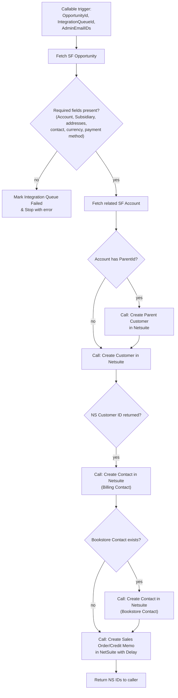

# NS & NF Automation - Callable - Salesforce to Netsuite Sales Automation

## Recipe Overview

This is a **callable orchestrator recipe** — the main controller that synchronizes a Salesforce Opportunity into NetSuite. Rather than doing the work itself, it validates the Opportunity and then calls a sequence of specialized sub-recipes to establish the Parent Customer, Customer, Billing/Bookstore Contacts, and finally the Sales Order/Credit Memo transaction.

Flow: it fetches the Opportunity by `OpportunityId`, then validates that all required cross-object fields are present (Account, Subsidiary, Bill-To Address, Ship-To Address, Billing Contact, Currency, Payment Method). If any is missing, it marks the `Integration_Queue__c` as "Failed" and stops. Otherwise, it checks the related Account for a `ParentId`: if present, it calls the **Create Parent Customer in Netsuite** sub-recipe first. It then always calls **Create Customer in Netsuite**. If that returns a NetSuite Customer ID, it calls **Create Contact in Netsuite** for the Billing Contact (always) and for the Bookstore Contact (only if one exists on the Opportunity), then calls **Create Sales Order/Credit Memo in NetSuite with Delay** to generate the actual financial transaction. Finally it returns the resulting NetSuite IDs to whoever called this recipe.

## Steps

### Step 0 — Trigger: Callable Execute

- **Name:** Execute (callable recipe trigger)
- **Logic (what it does?):** Entry point invoked by the Integration Queue trigger routing logic to process a Salesforce Opportunity end-to-end.
- **Inputs:** `OpportunityId`, `IntegrationQueueId`, `AdminEmailIDs`
- **Outputs:** Same as inputs, passed through as recipe parameters
- **Step Number:** 0
- **Previous Step Number:** — (entry point)
- **Next Step Number:** 1

### Step 1 — Fetch Salesforce Opportunity

- **Name:** Search for Opportunities in Salesforce
- **Logic (what it does?):** Looks up the Opportunity by `OpportunityId`, retrieving cross-object references needed downstream (Account ID, Subsidiary, Bill-To/Ship-To Address IDs, Billing/Bookstore Contact IDs, Currency Code, Payment Method).
- **Inputs:** `OpportunityId`
- **Outputs:** Opportunity fields (`AccountId`, `Subsidiary__c`, `Bill_To_Address__c`, `Labster_Ship_To_Address__c`/`Ubisim_Ship_To_Address__c`, `Billing_Contact__c`, `Bookstore_Contact__c`, `CurrencyIsoCode`, `Payment_Method__c`, etc.)
- **Step Number:** 1
- **Previous Step Number:** 0
- **Next Step Number:** 2

### Step 2 — Declare AdminEmailIds Variable

- **Name:** Create variable `AdminEmailIds`
- **Logic (what it does?):** Stores the incoming `AdminEmailIDs` parameter into a local variable for reuse across the sub-recipe calls.
- **Inputs:** `AdminEmailIDs` (trigger parameter)
- **Outputs:** `AdminEmailIds` (variable)
- **Step Number:** 2
- **Previous Step Number:** 1
- **Next Step Number:** 3

### Step 3 — Validate Required Opportunity Fields

- **Name:** IF Opportunity ID, Account ID, Subsidiary, Bill-To Address, Ship-To Address, Billing Contact, Currency Code (and other required fields) are present
- **Logic (what it does?):** The main pre-validation gate — fails fast if any required relational or financial field is missing before making any NetSuite API calls.
- **Inputs:** Opportunity fields from Step 1
- **Outputs:** None (control-flow only)
- **Step Number:** 3
- **Previous Step Number:** 2
- **Next Step Number:** 4 (if valid) or 15 (if invalid)

### Step 4 — Fetch Related Salesforce Account

- **Name:** Search Parent Account Id (Salesforce `search_sobjects` on Account)
- **Logic (what it does?):** Looks up the Account (`AccountId` from the Opportunity) to read its `ParentId` and `Name`.
- **Inputs:** Opportunity's `AccountId`
- **Outputs:** Account `ParentId`, `Name`
- **Step Number:** 4
- **Previous Step Number:** 3
- **Next Step Number:** 5

### Step 5 — If Account Has Parent

- **Name:** IF Account `ParentId` is present
- **Logic (what it does?):** Decides whether a Parent Customer needs to be established in NetSuite first.
- **Inputs:** Account `ParentId` from Step 4
- **Outputs:** None (control-flow only)
- **Step Number:** 5
- **Previous Step Number:** 4
- **Next Step Number:** 6 (if has parent) or 7 (either way, continues)

### Step 6 — Call: Create Parent Customer in Netsuite

- **Name:** Call sub-recipe `Create Parent Customer in Netsuite`
- **Logic (what it does?):** Invokes the Parent Customer callable recipe, passing the Account's `ParentId` as `ParentAccountId`, so the parent Account is synced to NetSuite before the child Customer.
- **Inputs:** `ParentAccountId` (= Account `ParentId`), `AdminEmailIds`, `Integration_Queue_ID` (= `IntegrationQueueId`)
- **Outputs:** `NSParentCustomerInternalId`, `Message` (not directly consumed further here)
- **Step Number:** 6
- **Previous Step Number:** 5
- **Next Step Number:** 7

### Step 7 — Call: Create Customer in Netsuite

- **Name:** Call sub-recipe `Create Customer in Netsuite`
- **Logic (what it does?):** Invokes the Customer callable recipe, passing the Opportunity's Subsidiary, Account ID, Opportunity ID, and address/contact/currency/payment fields, to create or update the NetSuite Customer.
- **Inputs:** `Subsidiary`, `AccountId`, `OpportunityId`, `BillToAddressId`, `ShipToAddressId`, `ContactID`, `NSParentCustomerId` (from Step 6, if applicable), `AdminEmailIds`, `OpportunityCurrencyCode`, `Integration_Queue_ID`, `Billing_Contact_Email__c`, `Bookstore_Contact_Email__c`, `Payment_Method__c`
- **Outputs:** `NSCustomerInternalId`, `Message`
- **Step Number:** 7
- **Previous Step Number:** 5 or 6
- **Next Step Number:** 8

### Step 8 — If Customer Synced Successfully

- **Name:** IF `NSCustomerInternalId` is present (from Step 7)
- **Logic (what it does?):** Only proceeds to Contact and Transaction sync if the Customer sub-recipe actually returned a NetSuite ID.
- **Inputs:** `NSCustomerInternalId` from Step 7
- **Outputs:** None (control-flow only)
- **Step Number:** 8
- **Previous Step Number:** 7
- **Next Step Number:** 9 (if present) or 14 (falls through to return, if not — no explicit else branch)

### Step 9 — If Billing Contact Exists

- **Name:** IF Opportunity `Billing_Contact__c` is present
- **Logic (what it does?):** Decides whether to sync the Billing Contact to NetSuite.
- **Inputs:** Opportunity `Billing_Contact__c`
- **Outputs:** None (control-flow only)
- **Step Number:** 9
- **Previous Step Number:** 8
- **Next Step Number:** 10 (if present) or 11 (either way, continues)

### Step 10 — Call: Create Contact in Netsuite (Billing Contact)

- **Name:** Call sub-recipe `Create Contact in Netsuite`
- **Logic (what it does?):** Syncs the Billing Contact to NetSuite and links it to the Customer created/updated in Step 7.
- **Inputs:** `ContactID` (= `Billing_Contact__c`), `SubsidiaryID` (= Opportunity `Subsidiary__c`), `NSCustomerID` (= Step 7's `NSCustomerInternalId`), `AdminEmailIds`
- **Outputs:** `NSContact_InternalId`, `Message`
- **Step Number:** 10
- **Previous Step Number:** 9
- **Next Step Number:** 11

### Step 11 — If Bookstore Contact Exists

- **Name:** IF Opportunity `Bookstore_Contact__c` is present
- **Logic (what it does?):** Decides whether to sync a secondary Bookstore Contact to NetSuite.
- **Inputs:** Opportunity `Bookstore_Contact__c`
- **Outputs:** None (control-flow only)
- **Step Number:** 11
- **Previous Step Number:** 9 or 10
- **Next Step Number:** 12 (if present) or 13 (either way, continues)

### Step 12 — Call: Create Contact in Netsuite (Bookstore Contact)

- **Name:** Call sub-recipe `Create Contact in Netsuite`
- **Logic (what it does?):** Syncs the Bookstore Contact to NetSuite (same sub-recipe as Step 10, called a second time for a different Contact ID) and links it to the same Customer.
- **Inputs:** `ContactID` (= `Bookstore_Contact__c`), `SubsidiaryID` (= Opportunity `Subsidiary__c`), `NSCustomerID` (= Step 7's `NSCustomerInternalId`), `AdminEmailIds`
- **Outputs:** `NSContact_InternalId`, `Message`
- **Step Number:** 12
- **Previous Step Number:** 11
- **Next Step Number:** 13

### Step 13 — Call: Create Sales Order/Credit Memo in NetSuite

- **Name:** Call sub-recipe `Create Sales Order/Credit Memo in NetSuite with Delay`
- **Logic (what it does?):** Invokes the transaction-generation callable recipe to create the actual financial document (Sales Order or Credit Memo) in NetSuite for this Opportunity/Customer.
- **Inputs:** `Opportunity_ID` (= `OpportunityId`), `Customer_ID` (= Step 7's `NSCustomerInternalId`), `AdminEmailIds`, `Integration_Queue_ID` (= `IntegrationQueueId`)
- **Outputs:** `NS_Salesorder_ID` (and related result fields)
- **Step Number:** 13
- **Previous Step Number:** 11 or 12
- **Next Step Number:** 14

### Step 14 — Return Result

- **Name:** Return Response: NS Internal ID
- **Logic (what it does?):** Returns the resulting NetSuite IDs to the caller of this orchestrator recipe.
- **Inputs:** `NS_Salesorder_ID` (Step 13), `NS_Customer_ID` (Step 7), `NS_Parent_Customer_ID` (Step 6), `NS_Contact_ID` (Steps 10/12)
- **Outputs:** `NS_Salesorder_ID`, `NS_Customer_ID`, `NS_Parent_Customer_ID`, `NS_Contact_ID`
- **Step Number:** 14
- **Previous Step Number:** 8 (if no customer ID) or 13 (normal path)
- **Next Step Number:** 18 (recipe end)

### Step 15 — Else: Required Fields Missing

- **Name:** `else` branch of Step 3
- **Logic (what it does?):** Taken when the Opportunity is missing one or more required fields.
- **Inputs:** —
- **Outputs:** —
- **Step Number:** 15
- **Previous Step Number:** 3
- **Next Step Number:** 16

### Step 16 — Mark Integration Queue Failed (Missing Fields)

- **Name:** Update Integration Queue: "Opportunity required fields are missing"
- **Logic (what it does?):** Sets `Processed_Flag__c = "Failed"` with a message listing the fields to check (Subsidiary, Bill To Address, Labster Ship To Address, Billing Contact, Opportunity Currency Code).
- **Inputs:** `IntegrationQueueId`
- **Outputs:** Updated Salesforce record
- **Step Number:** 16
- **Previous Step Number:** 15
- **Next Step Number:** 17

### Step 17 — Stop with Error (Required Fields Missing)

- **Name:** Stop ("Opportunity required fields are missing")
- **Logic (what it does?):** Ends the recipe run with an error.
- **Inputs:** —
- **Outputs:** —
- **Step Number:** 17
- **Previous Step Number:** 16
- **Next Step Number:** — (end of recipe, error)

### Step 18 — Stop

- **Name:** Stop
- **Logic (what it does?):** Final stop reached after the successful return path (Step 14).
- **Inputs:** —
- **Outputs:** —
- **Step Number:** 18
- **Previous Step Number:** 14
- **Next Step Number:** — (end of recipe, success)

## Key Business Logic Notes

- **Strict Pre-validation Gate:** Fails fast before any NetSuite API calls if Account, Subsidiary, Bill-To/Ship-To Address, Billing Contact, Currency, or Payment Method are missing on the Opportunity.
- **Modular Orchestration:** Delegates all actual record creation to four specialized sub-recipes (Parent Customer, Customer, Contact ×2, Sales Order/Credit Memo), keeping this recipe as pure orchestration/routing logic — a strong candidate to become a single n8n "controller" workflow that calls sub-workflows.
- **No Explicit Fallback if Customer Sync Fails:** Step 8 only has a `true` branch (no `else`); if `NSCustomerInternalId` isn't returned, the recipe skips straight to the (empty-valued) return step without marking the Integration Queue as failed — worth deciding whether to add explicit error handling here during the n8n migration.
- **Conditional Contact Sync:** Billing Contact and Bookstore Contact are synced independently and conditionally, both via the same `Create Contact in Netsuite` sub-recipe, linked to the same NetSuite Customer.
