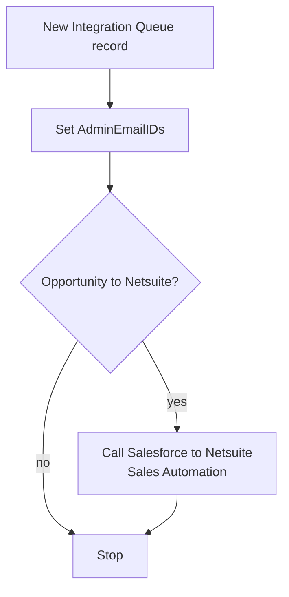

# Trigger - Salesforce Integration Queue Realtime Trigger

## Recipe Overview

This recipe is a **real-time trigger** recipe. It listens for new records created on the Salesforce custom object `Integration_Queue__c` (label "Integration Queue"). Salesforce's `Integration_Queue__c` object acts as an outbox/queue table: other automations (Flows, Apex, etc.) insert a row into it whenever something needs to be synced to an external system (e.g. NetSuite).

The trigger fires only when the new record satisfies all of these conditions:
- `Source_RecordId__c` is present
- `Object__c` is present
- `Target_System__c` is present
- `Processed_Flag__c` is present
- `Processed_Flag__c` equals `"Submitted"`

Once triggered, the recipe:
1. Reads an account-level property `AdminEmailIDs` into a local variable (used later for notifications by the called sub-recipe).
2. Checks whether the queued record is for an `Opportunity` object that must be pushed to `Netsuite`.
3. If so, calls the child/callable recipe **"Callable - Salesforce to Netsuite Sales Automation"**, passing the Opportunity's Salesforce ID, the Integration Queue record ID, and the admin email list.
4. Stops the recipe execution (without raising an error), regardless of whether the branch matched or not.

This recipe currently only implements routing for `Object__c = Opportunity` / `Target_System__c = Netsuite`. It is designed to be extended with more `if` branches as more object/target-system combinations need to be routed to their respective callable recipes (this is the only branch present today).

## Steps

### Step 0 — Trigger: New Integration Queue Record

- **Name:** New Integration Queue (Salesforce `new_custom_object_webhook` trigger on `Integration_Queue__c`)
- **Logic (what it does?):** Listens in real time for new/changed records on the Salesforce custom object `Integration_Queue__c`. Only lets an event through if `Source_RecordId__c`, `Object__c`, `Target_System__c` and `Processed_Flag__c` are all present **and** `Processed_Flag__c` equals `"Submitted"`. Effectively this is a "process only fully-populated, submitted queue items" filter.
- **Inputs:**
  - Salesforce object: `Integration_Queue__c`
  - Watched fields: `Id`, `Object__c`, `Target_System__c`, `Source_RecordId__c`, `Processed_Flag__c`
  - `since_offset`: `0` (start picking up events from recipe start)
- **Outputs:**
  - `Id` (Integration Queue record ID)
  - `Object__c` (name of the Salesforce object that originated the request, e.g. `Opportunity`)
  - `Target_System__c` (destination system, e.g. `Netsuite`)
  - `Source_RecordId__c` (ID of the source record, e.g. the Opportunity ID)
  - `Processed_Flag__c` (status flag, expected `"Submitted"` to pass the filter)
  - `CreatedDate`, `LastModifiedDate`, `SystemModstamp` (standard Salesforce audit fields)
- **Step Number:** 0 (trigger)
- **Previous Step Number:** — (entry point)
- **Next Step Number:** 1

### Step 1 — Declare Variable AdminEmailIDs

- **Name:** Create variable AdminEmailIDs
- **Logic (what it does?):** Declares a recipe-scoped variable `AdminEmailIDs` and initializes it with the Workato account property `AdminEmailIDs` (a workspace-level configuration value, presumably a comma-separated list of admin email addresses used for error/notification purposes downstream).
- **Inputs:**
  - Account property: `AdminEmailIDs`
- **Outputs:**
  - Variable `AdminEmailIDs` (string)
- **Step Number:** 1
- **Previous Step Number:** 0 (trigger)
- **Next Step Number:** 2

### Step 2 — IF Object is Opportunity and Target is Netsuite

- **Name:** (unnamed `if` condition block)
- **Logic (what it does?):** Evaluates a compound AND condition on the trigger's output:
  - `Object__c` equals `"Opportunity"`
  - `Target_System__c` equals `"Netsuite"`

  If both are true, execution enters the branch (Step 3). If false, the branch is skipped and execution falls through directly to Step 4 (Stop). There is no `else` block, so no action beyond the mandatory stop is taken for other object/target combinations — this is the single routing rule implemented so far.
- **Inputs:**
  - `Object__c` (from trigger output)
  - `Target_System__c` (from trigger output)
- **Outputs:** None (control-flow only; no data produced)
- **Step Number:** 2
- **Previous Step Number:** 1
- **Next Step Number:** 3 (if condition is true) or 4 (if condition is false)

### Step 3 — Call Recipe: Callable - Salesforce to Netsuite Sales Automation

- **Name:** Call `N8N Test: Callable - Salesforce to Netsuite Sales Automation`
- **Logic (what it does?):** Invokes the callable child recipe that performs the actual Opportunity → NetSuite sales automation logic, passing along the Opportunity ID, the Integration Queue record ID (so the child recipe can update/mark it as processed), and the admin email list for notifications.
- **Inputs:**
  - `OpportunityId` = trigger's `Source_RecordId__c`
  - `IntegrationQueueId` = trigger's `Id`
  - `AdminEmailIDs` = variable from Step 1
- **Outputs:** Whatever the child recipe returns (not consumed further in this recipe)
- **Step Number:** 3
- **Previous Step Number:** 2 (only reached when the IF condition is true)
- **Next Step Number:** 4

### Step 4 — Stop

- **Name:** Stop
- **Logic (what it does?):** Terminates the recipe run without raising an error (`stop_with_error = false`), whether or not the IF branch (Step 2/3) executed.
- **Inputs:**
  - `stop_with_error`: `"false"`
- **Outputs:** None
- **Step Number:** 4
- **Previous Step Number:** 3 (if branch taken) or 2 (if branch skipped)
- **Next Step Number:** — (end of recipe)
